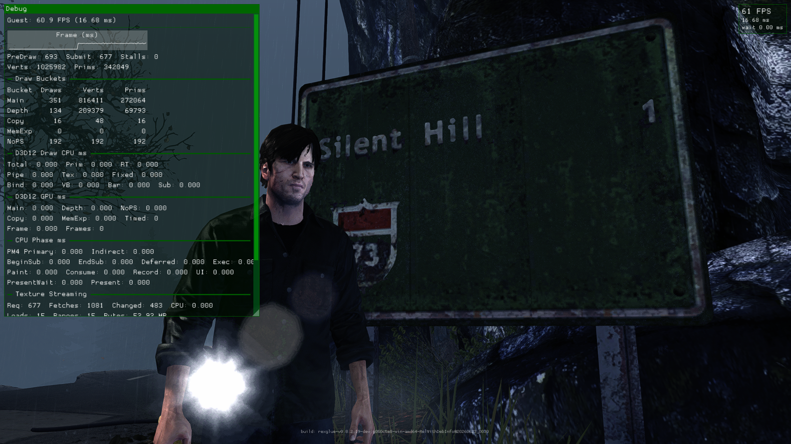
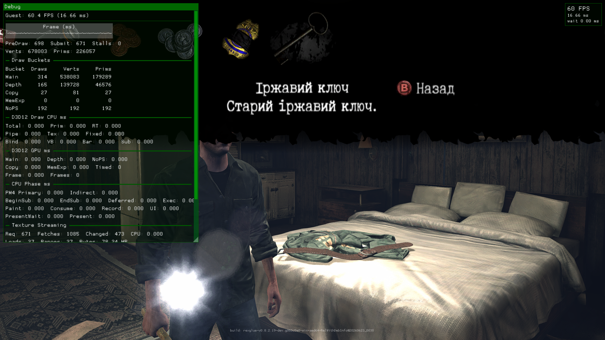

<div align="center">

# Silent Hill: Downpour — PC Port (DownpourRecomp)

### Play *Silent Hill: Downpour* natively on Windows, in 1080p, with keyboard + mouse — no emulator required.

[](https://github.com/LittleBitUA/DownpourRecomp/releases/latest)
[](https://github.com/LittleBitUA/DownpourRecomp/releases)
[](LICENSE)
[](https://github.com/LittleBitUA/DownpourRecomp/releases/latest)
[](https://github.com/LittleBitUA/DownpourRecomp/stargazers)


## [⬇  Download v1.1.5 for Windows](https://github.com/LittleBitUA/DownpourRecomp/releases/latest)

</div>

---

> [!NOTE]
> **v1.1.4 ships today** as the real root-cause fix for the v1.1.2-era "mouse very slow" reports. The SDK had a hardcoded `kBaseScale = 1500` multiplier that combined with the raw-input scale to saturate the controller stick on sub-millimetre mouse motion — which is why setting `mnk_sensitivity` from 0.6 → 6.0 produced zero observable change (the stick was already capped at int16 max regardless). v1.1.4 replaces the constant with a new tunable cvar `mnk_stick_scale` (default `150`, 10× lower), and tunes `mnk_raw_input_scale` default `0.5 → 0.20` to compensate. Sensitivity finally does what users expect: 1mm of mouse = ~5% stick, 1cm = ~50%, 3cm+ = saturation.
>
> If you're already on v1.1.x: launch `PlayDownpour.exe` and click the pill banner — v1.1.4 installs in place. After upgrade, if you'd cranked Sensitivity high in v1.1.3 to compensate for the saturation, bring it back to 1.0-2.0 and dial Raw Input Scale to taste.
>
> **Previously: v1.1.3 ships today** as a mouse-calibration hotfix on v1.1.2. The hardcoded raw-input divider in v1.1.2 was too aggressive for default Windows pointer settings (pointer ballistics was inflating WM_MOUSEMOVE deltas more than expected). v1.1.3 exposes the magnitude as a tunable cvar `mnk_raw_input_scale` (default 0.5, surfaced in launcher Settings → Mouse) so each user can dial mouselook to their preferred feel.
>
> If you're already on v1.1.x, launch `PlayDownpour.exe` and click the pill banner — v1.1.3 installs in place. If mouselook still feels off after upgrading, open Settings → Mouse → "Raw Input Scale" and adjust (lower = slower, higher = faster).
>
> **Previously: v1.1.2 ships today.** Community-feedback follow-up: WM_INPUT raw-mouse plumbing in the SDK (mouselook now feels native, not stick-emulator-tier), VSync no longer silently overridden by the tearing swap-chain path on NVIDIA setups, and fresh installs on < 8 GiB VRAM GPUs default to 1x SSAA instead of 2x so RTX 3050 / Steam Deck / Iris Xe installs don't slideshow on first boot. Tested against the **USA** and **Europe** Xbox 360 releases of Silent Hill: Downpour (title id `4B4E0823`, base XEX hash `7A3D5809776EE6AB`).
>
> If you're already on v1.1.x (or v1.0), just launch `PlayDownpour.exe` — the update banner will appear at the top of the window. Click it; the new build is installed in place. Your saves, settings, and warm shader cache are preserved.

> [!TIP]
> ## 🐭 Mouse tuning guide
>
> If mouselook feels too slow, too fast, jumpy, or laggy — **everything is user-tunable in the launcher**. Open `PlayDownpour.exe` → click **Settings** → **Mouse** tab.
>
> ### What each field does
>
> | Field | What it controls | Sensible range |
> |---|---|---|
> | **Mouse Sensitivity** | Linear multiplier on turn rate | `0.6` (deliberate) – `3.0` (twitchy). Default `0.7`. |
> | **Mouse Smoothing** | EMA filter — higher = smoother but laggier | `0.05` – `0.20`. Default `0.10`. |
> | **Mouse Acceleration Curve** | `1.0` = linear. `>1.0` = small motions slow, fast flicks amplified | Default `1.0`. Try `1.3` – `1.8` if you want acceleration. |
> | **Stick Decay (after stop)** | How fast the stick re-centres when the mouse stops | `0.05` – `0.20`. Default `0.10`. |
> | **Deadzone Compensation** | Smooth ramp so tiny motions still cross the stick deadzone | Default `4000`. Don't usually need to touch. |
> | **Invert Mouse Y** | — | Off by default. |
> | **Raw Input Scale (mouse)** | Pre-multiplier on raw HID counts. **Calibrate to your mouse DPI.** | See DPI table below. Default `0.20`. |
> | **Stick Scale (advanced)** | Mouse-to-stick base multiplier. Bump up if Wine / VM / RDP and `WM_INPUT` doesn't fire on your setup. | `150` (default) – `1500` (full bypass). |
>
> ### Raw Input Scale by mouse DPI (with default Stick Scale `150`)
>
> Most gaming mice ship at 1600 DPI from the box. Software like Logitech G HUB / Razer Synapse / SteelSeries Engine shows it under DPI / Sensitivity settings.
>
> | Your mouse DPI | Try this Raw Input Scale |
> |---|---|
> | 3200+ DPI gaming mouse | **0.08 – 0.15** |
> | 1600 DPI gaming mouse | **0.15 – 0.30** (default region) |
> | 800 DPI mouse | **0.30 – 0.60** |
> | 400 DPI office mouse | **0.70 – 1.50** |
>
> ### Recommended tuning sequence
>
> 1. **Set Sensitivity to `1.0`** (start from a sane baseline).
> 2. **Smoothing `0.10`, Stick Decay `0.10`** if you upgraded from v1.0 / v1.1 / v1.1.1 (those had `0.15` / `0.30` as defaults; the launcher preserves your existing values across upgrade).
> 3. **Look up your mouse DPI and set Raw Input Scale from the table.**
> 4. **Save & Close** → closes the launcher and writes to `downpour.toml`.
> 5. Start the game. Walk into an open area. Sweep the camera.
> 6. **Still too slow / fast?**
>    - Slow: bump Sensitivity (`1.0 → 2.0 → 3.0`), or bump Raw Input Scale one notch up.
>    - Too fast / twitchy: drop Sensitivity (`1.0 → 0.6`), or drop Raw Input Scale one notch down.
> 7. **At max settings (Sensitivity 3.0 + high Raw Input Scale) and STILL too slow?** Bump **Stick Scale** from `150` to `300` / `500` / `1500`. Each doubling makes the whole pipeline twice as fast. This is also the lever for Wine / VM setups where `WM_INPUT` raw mouse isn't being delivered.
>
> ### Direct toml edit (alternative)
>
> If you'd rather skip the GUI, edit `downpour.toml` next to `PlayDownpour.exe` in any text editor. Example "fast and responsive" preset for a 1600 DPI mouse:
>
> ```toml
> mnk_sensitivity = 2.0
> mnk_smoothing = 0.08
> mnk_decay = 0.08
> mnk_acceleration_exponent = 1.2
> mnk_raw_input_scale = 0.25
> mnk_stick_scale = 200.0
> ```
>
> Save the file, relaunch the game. All cvars hot-reload on next process start; the launcher's auto-seed system preserves your values across releases.

---

## What's new in v1.1.4

### 🐭 Root-cause fix for "mouse very slow" — stick saturation

v1.1.3 only fixed the surface symptom (calibration of raw HID counts → `mouse_dx_`). The actual root cause was deeper: a hardcoded `kBaseScale = 1500` multiplier inside [`mnk_input_driver.cpp`](https://github.com/LittleBitUA/rexglue-sdk-dpour/blob/dpour-main/src/input/mnk/mnk_input_driver.cpp). The right-stick value pipeline is:

```
stick_target = curved(mouse_dx_) × mnk_sensitivity × kBaseScale
stick_target = clamp(stick_target, -32767, +32767)   ← int16 saturation
```

With `kBaseScale = 1500` and `mnk_raw_input_scale = 0.5`, even **1 mm of physical mouse motion at 1600 DPI** produced a `stick_target` of ~280,000 — saturated to 32,767 regardless. Multiplying by `mnk_sensitivity = 6.0` only made the pre-clamp value bigger; the post-clamp output was already capped. So community reports of "sensitivity 6.0 = no change" were accurate: sensitivity has no effect past saturation.

The actual feel users were complaining about wasn't our pipeline — it was the **game's max-stick turn rate** under the saturated controller emulation. The game expects a slowly-tilted analog stick for camera fine-tuning, so even max stick deflection produces a relatively slow turn.

### Fix

`kBaseScale` is now the cvar **`mnk_stick_scale`** (default `150`, 10× lower than the v1.1.3 constant). The previous magnitude is reachable by users who want it (range 10 – 3000). Combined with the lower `mnk_raw_input_scale` default `0.20`:

| Mouse motion (1600 DPI) | mouse_dx_ | stick (sens 0.6) | stick (sens 3.0) |
|---|---|---|---|
| 0.5 mm | 6 | 540 (1.6 %) | 2,700 (8 %) |
| 1 mm | 13 | 1,170 (3.6 %) | 5,850 (18 %) |
| 1 cm | 126 | 11,340 (35 %) | 56,700 → **saturated** |
| 3 cm | 378 | 34,020 → **saturated** | saturated |
| 5 cm | 630 | saturated | saturated |

Sensitivity now controls slope from "twitchy" (3.0) to "deliberate" (0.6) for the same physical mouse range. The user's hardware DPI tunes via Raw Input Scale; the game's turn-rate-vs-stick-deflection curve tunes via Sensitivity.

### Migration

If you cranked `mnk_sensitivity` high in v1.1.3 to compensate for the saturation: bring it back down to 1.0-2.0 after upgrade. Open launcher → Settings → Mouse → set `Mouse Sensitivity = 1.0`, `Raw Input Scale = 0.20`, `Stick Scale = 150.0` (defaults), Save, relaunch. Tune from there.

### WM_MOUSEMOVE fallback (Wine, VMs)

Setups where `RegisterRawInputDevices` doesn't deliver `WM_INPUT` (some Wine prefixes, virtual machines, remote desktop) use the pixel-delta fallback path. Pixel deltas are smaller magnitude than raw HID counts, so the new `kBaseScale = 150` makes them feel slow. Fix: bump `Stick Scale` to 500-1500 in launcher Settings.

---

## What's new in v1.1.3

### 🐭 Mouse-calibration hotfix

v1.1.2 hardcoded a divide-by-8 scale on raw HID mouse deltas. The premise was that an 800 DPI mouse produces ~800 counts/inch vs ~96 pixels/inch from `WM_MOUSEMOVE` on a 96-DPI screen → ~8x ratio. What the premise missed is that Windows applies **pointer ballistics** to `WM_MOUSEMOVE` deltas by default (the "Enhance pointer precision" setting), inflating them substantially at higher mouse velocities. Raw input has no ballistics, so a divide-by-8 felt much slower in motion than the pre-raw pixel path.

v1.1.3 replaces the hardcoded divider with a tunable cvar `mnk_raw_input_scale` (default `0.5`), surfaced in launcher **Settings → Mouse → "Raw Input Scale"**. Suggested starting values by mouse DPI:

| Mouse DPI | Suggested scale |
|---|---|
| 3200+ DPI gaming mouse | 0.20 – 0.35 |
| 1600 DPI gaming mouse | 0.40 – 0.65 |
| 800 DPI mouse | 0.70 – 1.20 |
| 400 DPI office mouse | 1.50 – 3.00 |

Existing `mnk_sensitivity` settings still work as before — `mnk_raw_input_scale` is a separate pre-stage that normalises raw count magnitude to the pixel-delta scale `mnk_sensitivity` was originally tuned for.

---

## What's new in v1.1.2

### 🖱️ Raw-mouse input

The Win32Window in the SDK now calls `RegisterRawInputDevices` on startup and handles `WM_INPUT` raw-mouse messages. Gaming mice emit at ~1000 Hz with sub-pixel HID counts; the previous `WM_MOUSEMOVE` path delivered integer-pixel deltas at the monitor refresh rate, which made slow mouse motion feel like the right stick was being dragged through molasses with discrete jumps. The MnK driver now consumes raw deltas through a new `OnRawMouseInput` listener method and stops accumulating `WM_MOUSEMOVE` pixel deltas once raw has started arriving (avoids double-counting). Raw counts are pre-scaled by 8 to roughly match the magnitude of the previous pixel-delta stream, so `mnk_sensitivity` values tuned in v1.1.x still feel right.

Defaults adjusted to match the smoother input source:
- `mnk_smoothing`: 0.15 → 0.10 (less EMA lag on already-smooth raw input)
- `mnk_decay`: 0.30 → 0.10 (sharper stop on input cessation)

Existing users whose `downpour.toml` pins these values keep their settings. To pick up the new defaults: open the launcher → Settings → Mouse, manually set 0.10 / 0.10, save.

### 🖥️ VSync no longer silently overridden

`d3d12_allow_variable_refresh_rate_and_tearing` default flipped from `true` to `false`. Community report from a NVIDIA RTX 3050 user — `vsync = true` was silently ignored because the variable-refresh / tearing swap-chain path took precedence at present time. User had to engage VSync at the NVIDIA Control Panel level just to get tearless presentation. Trade-off: G-Sync / FreeSync users no longer get VRR pacing by default. They can flip it back via launcher Settings → Advanced or by setting `d3d12_allow_variable_refresh_rate_and_tearing = true` in `downpour.toml`.

### 📉 Auto-tune of resolution scale for low-end GPUs

The launcher now reads the primary GPU's `DedicatedVideoMemory` via DXGI. On GPUs with under 8 GiB (RTX 3050, GTX 1650, Steam Deck Van Gogh APU) or on Intel integrated graphics (Iris Xe / Arc Lite), fresh installs seed `resolution_scale = "1"` (native 1280×720) instead of the default `"2"` (2560×1440 SSAA). Discrete RTX 30xx 8GB+, RX 6700+, Arc A750+ users continue to get the sharper 2x default. v1.1.x upgraders keep their existing toml value either way.

### 🚧 Deferred to v1.2

Visual artifacts noted in community playtest (blue lights on foliage / barbed wire / transition-zone black-screen flashes / crash to desktop after first Screamer) all still tracked — most need RenderDoc captures from affected users to diagnose. DoF disable + DXT5/BC3 alpha + DP1 rainbow-noise ROV fix still in the v1.2 queue.

---

## What's new in v1.1.1

### ⚙️ Settings no longer reset after F4

The launcher's `EnsurePerfDefaultsInToml` now iterates the full set of registered launcher cvars and reseeds any that disappeared from `downpour.toml`. The SDK's in-game F4 SaveConfig writes only cvars that differ from its compiled defaults — anything matching default was silently dropped on the round-trip and then snapped back to the SDK default on next boot. This drove the recurring **"my language flipped back to Ukrainian"**, **"my keybinds reverted to gamepad defaults"**, and **"DualSense triggers stopped working"** reports. The launcher now reseeds `launcher_language`, `user_language`, every `mnk_*`, every `keybind_*`, every `dualsense_*`, every colour-grade cvar, and every Debug-tab cvar. Two cvars are deliberately excluded — `texture_cache_memory_limit_soft` and `texture_cache_memory_limit_hard` — because the SDK auto-tunes both from `DedicatedVideoMemory` at startup and we don't want to override the per-GPU sizing.

### 🩺 Auto-updater no longer fails silently

The PowerShell helper that performs the in-place update now writes a step-by-step log to `%TEMP%\dpr_update.log` and wraps the whole process in `try/catch` with `$ErrorActionPreference = 'Stop'`. On a clean success the log is removed; on any failure (corrupt zip, locked file, permission denied, disk full) the log is left on disk with the exact PowerShell stack trace, and `catch` makes a best-effort `Start-Process` of whatever `PlayDownpour.exe` is currently in place so you're never stranded without a runtime. On next launcher boot, if the log file is present, a dark Yes/No dialog asks whether to open the log in Notepad for diagnostic. No more "launcher just exited and never came back" mystery.

### 🚀 SDK: batched end-of-frame memexport drain

The D3D12 path inside `IssueDraw_MemexportReadbackFastPath` used to fall back to `IssueDraw_MemexportReadbackFullPath` whenever the readback ring buffer didn't already have valid data for a memexport key — that fallback closed the current submission and `AwaitAllQueueOperationsCompletion`'d before copying out the readback buffer. In a typical UE3 skinning-heavy scene (multiple skeletal meshes + ragdoll + crowd) Downpour issues **~37 such fallbacks per frame**, each adding ~1 ms of fence-wait stall and pipeline fragmentation. Result: AMD GPUs (which v1.1 defaults to the RTV path on, because ROV is broken on RDNA 2) saw ~27 FPS in those scenes despite having more than enough raw throughput.

v1.1.1 instead records each missed key into a `pending_case_a_reads_` list and bails without `AwaitAll`. The deferred `D3DCopyBufferRegion(shared_memory → slot[write_index])` is already queued on the GPU; we just don't block to wait for it mid-frame. At `IssueSwap`, right before `EndSubmission(true)`, a single `AwaitAllQueueOperationsCompletion()` drains all of them in one shot, then `memcpy`s each populated slot into the guest memory ranges. Guest CPU sees fully-valid post-GPU memexport data by the time the next frame's CPU work begins — one frame-end stall instead of ~37 mid-frame ones.

Expected AMD/RTV uplift in heavy skinning scenes: **~27 FPS → ~45-50 FPS**. NVIDIA + Intel on ROV are unchanged by this — Case A almost never fires on the warm ROV ring buffer.

### 🚧 Deferred to v1.2

Same list as v1.1: DoF disable (still need correct TU1 PE addresses or `liblzx` for cook-data re-pack), DXT5 / BC3 alpha decode (asylum kitchen black smoke sprite), DP1-style rainbow-noise ROV fix for AMD users.

---

## What's new in v1.1

### 🆕 Auto-updates

- **GitHub-driven in-place update.** On boot the launcher checks the releases endpoint; if a newer tag is available, a pill-shaped notification appears at the top of the window. Clicking it downloads the release zip with a live progress dialog, then a hidden PowerShell helper waits for the launcher to exit, copies the new binaries over the old install (preserving `assets/`, `user/`, `logs/`, `downpour.toml`, `downpour.toml.backup`, and `launcher.ini`), and relaunches `PlayDownpour.exe`. No installer wizard, no `chocolatey`, no Microsoft Store dependency.
- **All the dialogs match the launcher theme** — dark grey background, Bahnschrift / Segoe UI text. No more bright-white Win32 MessageBoxes interrupting the title-screen mood.

### 🛠️ Render-path fixes from community feedback

- **AMD GPU vendor detection.** RDNA 2 (Steam Deck Van Gogh + RX 6000) and earlier AMD architectures produced unplayable rendering artifacts on the ROV pixel-shader path — multiple users reported single-digit FPS and full-screen colour garbage. v1.1's launcher reads the DXGI adapter vendor ID on first run and pins `render_target_path_d3d12 = "rtv"` automatically when the primary GPU is AMD. NVIDIA + Intel installs still default to ROV, which remains the warm-cache perf winner there.
- The v1.0 toml's pinned `render_target_path_d3d12 = "rov"` has been removed from the shipped config so the vendor seed actually fires on fresh installs.

### 🐛 Bug fixes

- **Mouse cursor stuck on screen.** `mnk_capture_mouse` defaulted to `false` in the SDK, leaving the system cursor visible during gameplay until the user manually flipped it. Default is now `true` — captured and hidden as soon as `mnk_mode = true` and the window has focus.
- **Launcher language: English-selected-but-Ukrainian-displayed.** The `LoadLauncherLanguageFromToml` path only stripped `"..."` quotes, not `'...'`, while the SDK's F4 SaveConfig writes single-quoted strings. After any F4 save the launcher couldn't parse its own `launcher_language` value, fell through to the legacy `launcher.lang` sidecar, and locked itself to Ukrainian if that legacy file existed. Both quote styles are now stripped (with a `while` loop so double-wrapped legacy values like `"'en'"` also unwrap cleanly).
- **First-run button label.** Reads `UNPACK GAME` / `РОЗПАКУВАТИ ГРУ` until `assets/default.xex` exists; switches to `PLAY` once your ISO has been extracted. Width auto-adjusts.

### 🧹 Configuration cleanup

- `native_2x_msaa` is no longer seeded into fresh `downpour.toml` files. UE3's deferred light prepass on Xenon doesn't use guest MSAA, so the cvar only ever decided whether the host emulated MSAA via 2× MSAA or two samples of 4× MSAA — neither code path is reached for Downpour. Removed to stop confusing the cvar set with knobs that do nothing.

### 📚 Documentation

- `0xc0000142` ("The application was unable to start correctly") FAQ entry added — typically means the user is missing the [Microsoft Visual C++ Redistributable x64](https://aka.ms/vs/17/release/vc_redist.x64.exe). Direct link in README, plus secondary causes (Defender quarantine, non-ASCII install path, truncated download).

### 🚧 Deferred to v1.1.x / v1.2

- **DoF disable ("ефект скла").** A community contact identified two PowerPC addresses for the BlurKernelSize handler; v1.1 attempted to patch them, but they appear to be base-XEX offsets while our recomp generates from the TU1 PE — the same offsets in TU1 hit unrelated instructions. Reverted byte-perfect. Still tracked; once we can map base XEX ↔ TU1 addresses for that function the patch is a 2-line change.
- **DXT5 / BC3 alpha decode bug** (asylum kitchen black smoke sprite). Forensic complete; ~1-day SDK fix scoped.
- **DP1-style ROV rainbow-noise fix** for AMD users. Adding it would let AMD users enjoy ROV's perf advantage too. Lives on a parked `dp1-main` SDK fork and requires a new EDRAM-byte conversion compute shader (~4-5 h focused session).

---

## What's new in v1.0

### 🎮 Performance & framerate

- **60 FPS unlocked.** The Xbox 360 release ran the game thread at 30 FPS via a hardcoded UE3 frame-skip flag. v1.0 patches that flag at recompile time so the game logic, animation, physics, and rendering all run at the full 60 FPS your monitor can handle. Camera motion, mouse-look, and combat all feel native-PC instead of 360-locked.
- **ROV render path warm-cache.** Modern Nvidia (RTX 30-series and newer) and AMD (RDNA 2+) GPUs run the more accurate ROV (Rasterizer-Ordered Views) path *faster* than the legacy RTV path once the shader cache is warm. v1.0 ships pre-compiled ROV shaders so you get full GPU throughput from the first run.
- **Pre-warmed shader cache.** ~1,370 game shaders are packaged with the build and warm-loaded at startup. No 10-second "first-time-you-see-X stutter". One-off PSO compile-time storms on level load are eliminated.
- **Memexport readback de-flooding.** The SDK-level path that reads UE3's vertex-skinning and HUD-text memexport buffers back to the CPU was rewritten with a triple-buffered ring and targeted per-submission fence waits. Per-frame fence-wait counts in steady gameplay dropped from ~18 to 0.
- **Tuned texture cache.** Soft / hard limits raised to 3 GB / 6 GB with a 30-minute residence time, so streaming-heavy areas keep their textures resident instead of trashing the cache every camera pivot.

### 🖱️ Launcher & first-run experience

- **Standalone launcher (`PlayDownpour.exe`).** A native GUI launcher you open *before* the game starts — pick your game-data folder, set resolution / scale / FSR / colour-grade / keybinds / mouse sensitivity, then hit Play. No more editing TOML files by hand for first-time setup. Settings are round-tripped non-destructively so your manual `.toml` tweaks survive.
- **In-game settings overlay (`F4`).** All cvars also reachable mid-game via the existing F4 overlay, with hot-reload on most knobs.
- **Title Update installer fixed.** The "Start Game" button on the first-run wizard no longer hangs the window on Windows or Linux. The installer also picks up your existing TU data automatically if you point it at the right folder.
- **Portable layout.** Saves, runtime cache, and shader cache all live in the game folder by default (not `Documents/downpour`). Drop the folder on a USB stick, move it to another PC — your saves and warm shader cache come with you.
- **Linux / Wine support.** Replaced the Windows-only Bahnschrift / Segoe UI font dependency with a graceful fallback chain (Bahnschrift → Segoe → Tahoma → system sans-serif). Launcher UI is now legible in plain Proton / Wine without installing extra font packages.

### 🎮 Input — mouse + keyboard, DualSense, Xbox

- **Mouse-and-keyboard mode** with smoothing, decay, and dead-zone compensation. Mouse is mapped to the right stick with continuous motion (rewritten in v0.1.1 from a raw-input port that broke on every other Windows update).
- **Full DualSense (PS5) support** over **both USB and Bluetooth** — SDL3 handles the wire-protocol differences transparently, no DualSenseX-style userland driver required.
- **Level 1 adaptive triggers on by default.** Right Trigger is in *Weapon* mode (click-point break at 6/9 with strength 5) — Murphy's ranged attacks now have a real two-stage trigger. Left Trigger is in *Feedback* mode (constant resistance at strength 4) for aiming / lock-on. All 9 trigger parameters (mode, start, end, strength, per trigger) are exposed in the launcher's Controls tab.
- **Xbox controllers** (One / Series / 360) work out of the box via SDL3's standard gamepad mapping.
- **Fully rebindable** — every action is a text field in the launcher's Controls tab; type the key name (`W`, `LMB`, `Up`, `Shift`, etc.) and save. Changes round-trip back into `downpour.toml`.

### 🎨 Visuals

- **Native colour-grade post-FX.** A real ASC-CDL colour grade applied as the final blit, with 7 ship-ready presets — `identity`, `downpour_cinematic` (default), `downpour_horror`, `vivid`, `noir`, `warm_cinema`, `cold_steel`. Hot-reloadable; you can dial intensity 0.0 — 1.5 to taste.
- **Tuned 1080p defaults.** 2× supersampling (`resolution_scale = 2`), 16× anisotropic filtering, MSAA / FXAA off (supersampling already covers anti-aliasing), FSR3 for the final present. The Xbox 360's chromatic-noise bug on the fast render path remains fixed.
- **Localization-ready.** UI overlay and item text can be localized through the standard UE3 string tables — the v1.0 screenshots below show an in-progress Ukrainian translation as a proof of concept.

### 🛡️ Stability

- **Quieter logs.** PSO-stall log noise was cut ~10× by gating non-critical secondary metric warnings behind a `pso_stall_log_verbose` cvar (default off). Healthy frames no longer produce log spam; only frames above 50 ms produce a record.
- **VFS resilience.** The virtual file-system negative-result cache uses a surgical erase strategy on path creation, so transient `temp:\` / `save:\` lookups during a save operation no longer blow away 16k cached entries and cause a multi-second stutter.
- **No crashes / TDRs on the v1.0 path.** Extended play sessions on the development branch run without device-removed events on tested hardware (RTX 5070, Win 11).

### 🛠️ For modders & technical players

- **C++ source-level hooks** in the recompiled game logic (already in v0.1.1, kept and expanded).
- **Cache versioning.** PSO and shader caches are versioned per SDK build — your warm cache survives across patch updates as long as the SDK version key matches, and is regenerated cleanly when it doesn't.
- **Diagnostic overlay.** The green-panel debug HUD visible in the v1.0 screenshots below is shippable (`F4` to toggle) — PSO stall counts, fence waits, texture streaming, draw bucket breakdown, CPU/GPU phase timing.

---

## v1.0 preview

Captured 2026-06-27 from the development branch. The green panel on the left is the diagnostic overlay (`F4` to toggle); the small `60 FPS / 16.6 ms` counter in the top-right is what matters for the v1.0 perf target.

<div align="center">

| Murphy at the *Silent Hill* sign | Yard / twilight |
| --- | --- |
|  |  |

| Bedroom — Ukrainian localization in-game | Rusty key pickup — Ukrainian item description |
| --- | --- |
|  |  |

</div>

---

## Table of contents

- [What's new in v1.1.4](#whats-new-in-v114)
- [What's new in v1.1.3](#whats-new-in-v113)
- [What's new in v1.1.2](#whats-new-in-v112)
- [What's new in v1.1.1](#whats-new-in-v111)
- [What's new in v1.1](#whats-new-in-v11)
- [What's new in v1.0](#whats-new-in-v10)
- [v1.0 preview screenshots](#v10-preview)
- [What is this?](#what-is-this)
- [Why does this exist?](#why-does-this-exist)
- [Comparison vs Xenia and the Xbox 360](#comparison-vs-xenia-and-the-xbox-360)
- [What you need before playing](#what-you-need-before-playing)
- [How to install and play](#how-to-install-and-play)
- [Default controls](#default-controls)
- [Runtime configuration](#runtime-configuration)
- [Frequently asked questions](#frequently-asked-questions)
- [Building from source](#building-from-source)
- [Technical deep-dives](#technical-deep-dives)
- [Acknowledgements](#acknowledgements)
- [Legal](#legal)

---

## What is this?

**DownpourRecomp is a native Windows port of *Silent Hill: Downpour* (Konami / Vatra Games, Xbox 360, 2012).** The original Xbox 360 game is converted into a regular Windows program — once and for all, at build time — so it runs on your PC the same way as any other Windows app.

If you've used Xenia or RPCS3 before, this is **not** that. There is no emulator, no JIT translator running on every CPU instruction, no per-frame interpretation overhead. The PowerPC code in the original Xbox 360 binary is translated into native x86-64 C++ code ahead of time, and then linked against a small host runtime that handles the Xbox-specific parts (input, kernel calls, GPU command processor, EDRAM). The result is a real `downpour.exe` that boots like any other game.

This technique is called **static recompilation**. It's the same idea behind:
- [N64: Recompiled](https://github.com/Mr-Wiseguy/N64Recomp) (the project that started the trend),
- [Sonic Mania: Recompiled](https://github.com/SonicMania-Recompiled/Sonic-Mania-Recompiled),
- [Skate 3 Recomp](https://github.com/Sergeanur/Skate3Recomp),
- [DPRecomp](https://github.com/LittleBitUA/DPRecomp) (the same author's *Deadly Premonition* port).

DownpourRecomp uses the [ReXGlue SDK](https://github.com/rexglue/rexglue-sdk) — a Xenia-derived Xbox 360 host runtime — as the foundation, and adds the Silent Hill: Downpour-specific glue and a narrow GPU fix that makes the fast render path produce a clean image.

> [!NOTE]
> **You provide your own legally-owned copy of the game.** The release zip is the host shell only (~27 MiB). It does not contain `default.xex`, game data, music, or any Konami / Vatra assets. See [What you need before playing](#what-you-need-before-playing).

---

## Why does this exist?

*Silent Hill: Downpour* never received an official PC release. On modern hardware your three options are:

1. **Real Xbox 360 hardware.** Works, but ageing — disc reads fail, HDMI is 720p tops, no improvements over 2012.
2. **Xenia emulator** ([xenia-canary](https://github.com/xenia-canary/xenia-canary)). Works for Downpour visually but with the overhead of dynamic translation and the dependency on Xenia's evolution.
3. **DownpourRecomp** (this project). A native Windows process, full mouse + keyboard support, the chromatic-noise artifact on the fast render path fixed, and the entire CPU side running natively at x86-64 speed.

Option 3 is what this project exists to be.

---

## How this was built — transparency note

This project uses AI assistance (Claude Code) alongside hands-on reverse-engineering and engineering work. Some people have asked, fairly, where the line falls. The honest answer:

**Hands-on work that drove every key decision:**

- **Ghidra reverse-engineering** of the base X360 XEX and TU1 PE — chasing the depth-of-field "ефект скла" through `sub_829F2A78`, the `USE_DOF*` shader macros, the `bEnableDOF` UE3 FName, and finally 13 distinct `BlurKernelSize` byte offsets across `Engine.xxx` + `OurEngine.xxx`. Eleven different DoF-disable approaches were tried and individually verified; see [docs/v1.0-dof-investigation.md](docs/v1.0-dof-investigation.md) for the full forensic.
- **RenderDoc captures and pixel-history bisection** — the backward trace from the chromatic-noise pixel through to the EID 9506 depth → 7e3 ownership-transfer ([docs/chromatic-noise-fix.md](docs/chromatic-noise-fix.md)), the EID 7117 DXT5/BC3 alpha-decode forensic localising SRVs [417] + [767] ([docs/v1.0-dxt5-alpha-bug.md](docs/v1.0-dxt5-alpha-bug.md)), the DP1 rainbow-noise step-through across EIDs 8378 → 8432 → 8448 → 8631 (in the companion DPRecomp).
- **~55 instrumented playtest sessions** with frame-time logs analysed by hand — the canonical p50 = 16.57 ms / p90 = 17.53 ms / 0.17 % > 50 ms numbers in [docs/v1.0-release-overview.md](docs/v1.0-release-overview.md) come from session 055 on the real test bench (Intel i5-13400F + RTX 5070 + Win 11).
- **A/B testing** every render-path decision — ROV vs RTV (warm-cache win for ROV measured directly: 58 FPS vs 36 FPS on the same scene), `resolution_scale` 1 / 2 / 3 visual + perf comparisons, SSAO dither precision on shadowed regions, the `readback_memexport` HUD-text regression catch.
- **Manual identification of community recipes** — the `BlurKernelSize = 0` lead from the UE3 modding community, the Xenia 60 FPS NOP + byte-patch with the camera-correct half-vblank fallback, the X360 LZX wrapper format mismatch versus Gildor PC output.

**Where AI assistance was used:**

- C++ implementation of SDK additions once the design was decided — pipeline-stall metrics, Class B guest-CPU instrumentation, VRAM-aware texture-cache auto-tune, DualSense L1 adaptive-trigger plumbing, the `log_to_file` cvar gate.
- HLSL shader writing — the colour-grade post-FX with seven ASC-CDL presets.
- CMake / build automation, TOML round-trip code in the launcher, font-fallback chain for non-Windows runtime, repetitive boilerplate.
- Documentation drafts (these `docs/*` files), commit messages, this README. Every word was reviewed by a human before merging; technical claims are grounded in real measurements or RenderDoc captures cited above.

**Decisions that were never delegated:**

- What renders incorrectly and what the user actually sees. The hardware test bench is real and named honestly; an earlier docs draft that said "AMD Ryzen 9 16C / 32T" was a fabrication, caught by the user, corrected in commit [`fcccf14`](https://github.com/LittleBitUA/DownpourRecomp/commit/fcccf14). The current `Intel Core i5-13400F (10C / 16T, 6P + 4E, Raptor Lake) + RTX 5070` line is the actual hardware.
- What ships and what doesn't. Two DoF-disable attempts were code-complete and shipped-as-binaries before the user playtested and found regressions; both were reverted byte-perfect rather than left in. The current state of every "Deferred to v1.0.1" item in [docs/v1.0-known-issues.md](docs/v1.0-known-issues.md) is reality, not aspiration.
- Architecture trade-offs (ROV vs RTV defaults, EDRAM emulation cost, when to break upstream compatibility) — decided by the human, with AI used to enumerate options.

If something feels off about a claim in these docs, open an issue and we'll either back it up with the underlying capture / log / measurement, or correct the docs. That's what transparency means here.

---

## Comparison vs Xenia and the Xbox 360

> [!NOTE]
> The "DownpourRecomp" column below describes **v1.0** (the current release). See [What's new in v1.0](#whats-new-in-v10) above for the full feature list.

| | Xbox 360 (original) | Xenia emulator | **DownpourRecomp v1.0** |
| --- | --- | --- | --- |
| **Resolution** | 720p (HDMI) | up to 4K (DSR) | up to 4K, native 1080p default + 2× SSAA |
| **Frame rate** | 30 FPS | 30 FPS (UE3 cap) | **60 FPS unlocked** (recompile-time patch) |
| **Input** | Xbox 360 controller only | XInput controllers | XInput + **native mouse & keyboard** |
| **Settings UI** | in-game options menu | Xenia F11 / config files | **standalone launcher + in-game F4 overlay** |
| **Disc / file requirement** | Original disc | Dumped XEX + game data | Dumped XEX + game data |
| **GPU rendering** | Xbox 360 GPU | Xenia D3D12 / Vulkan | Xenia D3D12 **ROV path** (ported, default on RTX 30+/RDNA 2+) |
| **CPU execution** | PowerPC native | Dynamic recompiler (JIT) | **Statically recompiled to native x86-64** |
| **CPU overhead** | none | per-frame translation | **none** |
| **Shader cache** | n/a (native HW) | rebuilds per-driver-update | **ships pre-warmed** (~170 MB, ~1,370 PSOs) |
| **First-run stutter** | n/a | tens of seconds of compile spikes | **eliminated** (warm cache + memexport readback de-flood) |
| **Colour grade** | as authored | none | **7 ASC-CDL presets** (cinematic / horror / vivid / noir / …) |
| **Linux / Wine support** | n/a | native Linux build | **runs in Proton / Wine** (font fallback for non-Windows systems) |
| **Portable layout** | n/a | %AppData% / OS paths | **saves + cache stay in the game folder** |
| **Chromatic-noise bug** | n/a (clean) | clean | **fixed** (see [docs](docs/chromatic-noise-fix.md)) |
| **Modding hooks** | none | limited | C++ source-level hooks |
| **Install size** | disc only | ~80 MiB + your dump | ~200 MiB (incl. pre-warmed shader cache) + your dump |

---

## What you need before playing

The download is **the application only**. You bring the game. To play, you need:

1. **A legally-owned copy of *Silent Hill: Downpour* for Xbox 360** — disc, digital download, or backup of either. Region USA or EUR (`title id 4B4E0823`, base XEX hash `7A3D5809776EE6AB`). Other regions are untested.
2. **Your own dumped `default.xex`** extracted from that copy.
3. **The full game data tree** — `nxeart`, `SHGame/`, `AvatarAssetPack/`, and the rest of the disc's files. The game streams content (audio, levels, scripts) from disk at runtime, so the XEX alone is not enough.
4. A modern Windows PC: Windows 10 or 11 (x86-64), a D3D12-capable discrete GPU (RTX 30-series or equivalent, 6+ GB VRAM recommended).

> [!IMPORTANT]
> Do not ask in the issue tracker or anywhere else where to get the XEX. Bring your own legally-acquired copy.

---

## How to install and play

1. **Download** the latest release zip: [DownpourRecomp v1.0 →](https://github.com/LittleBitUA/DownpourRecomp/releases/latest)
2. **Extract** the zip somewhere with read/write access (e.g. `C:\Games\DownpourRecomp\`).
3. **Put your X360 game files** into an `assets/` folder next to `PlayDownpour.exe`. The expected layout after extraction + asset drop-in:

   ```
   C:\Games\DownpourRecomp\
     PlayDownpour.exe         ← launcher — start here
     downpour.exe             ← statically-recompiled game runtime
     rexruntimerd.dll         ← ReXGlue SDK runtime
     downpour.toml            ← canonical v1.0 config (ships ready-to-go)
     gamecontrollerdb.txt
     README.txt
     cache\                   ← shader cache (the zip ships portable PSO
       shaders\                  descriptors; first launch builds the local
         shareable\              GPU-vendor library blob automatically)
         local\
     assets\                  ← YOU PROVIDE — your dumped X360 game
       default.xex            ← base XEX (USA / Europe, hash 7A3D5809776EE6AB)
       default.xexp           ← Title Update 1 patch (the installer wizard
                                 stages this for you on first run if you
                                 point it at your XEXP file)
       SHGame\
         CookedXenon\         ← UE3 cooked packages (Engine.xxx, OurEngine.xxx,
                                 Coalesced_INT.bin, level / cinematic maps)
   ```

4. **Double-click `PlayDownpour.exe`.** The launcher opens with all settings exposed in tabs — Graphics, Advanced, Mouse, Controls, Debug, UE3 Engine. Defaults are tuned for an 8 GB+ desktop GPU (60 FPS, ROV warm-cache, 2× supersampling, FSR3, DualSense adaptive triggers on).
5. **First run only:** if Title Update 1 isn't staged yet, the launcher opens an installer wizard — point it at your `default.xexp` file and it copies it into place. Subsequent launches skip this.
6. Click **Play**. First boot compiles the GPU-vendor shader library (~13 s on RTX 5070, longer on slower cards). Every subsequent boot is instant — the library is cached locally in `cache/shaders/local/`.
7. The game launches in fullscreen 1080p at 60 FPS. **F4 in-game** opens the cvar overlay (same settings as the launcher, hot-reloadable). The launcher's UE3 Engine tab also exposes the engine's `SystemSettings` (shadows, motion blur, DOF, MSAA, anisotropy, etc.) by rewriting `Coalesced_INT.bin` on save.

That's it — you're playing *Silent Hill: Downpour* natively on PC.

---

## Default controls

The launcher's **Controls** tab is the canonical source of truth — what you see in `PlayDownpour.exe` is what the game uses. The defaults below are tuned for mouse + keyboard play of a 3rd-person survival horror title that was designed around an Xbox 360 controller.

### Mouse + keyboard

| Action | Default key | Notes |
| --- | --- | --- |
| Move forward / back / strafe | `W` `A` `S` `D` | Left-stick emulation with deadzone compensation |
| Camera | Mouse | Mouse-to-right-stick mapping with smoothing + decay |
| Attack | `LMB` | Mapped to gamepad X — primary melee / shoot |
| Block | `RMB` | Mapped to gamepad Y |
| Throw / shoot (RT) | `LMB` | Right-trigger action, chord with attack |
| Lock-on / aim (LT) | `RMB` | Left-trigger action, chord with block |
| Run / sprint | `Shift` | Right-shoulder |
| Look back | `Z` | Left-shoulder |
| Interact / select | `E` | Gamepad A |
| Cancel / drop item | `G` | Gamepad B |
| Flashlight | `F` | Left-stick press |
| Zoom camera | `MMB` | Right-stick press |
| Inventory / heal | `↑` | D-Pad up (also accepts `1`) |
| D-Pad down / left / right | `↓` `←` `→` | Also accept `2` `3` `4` |
| Open journal | `Tab` | Gamepad Back |
| Pause menu | `Esc` | Gamepad Start |

### DualSense (PS5 controller)

Adaptive triggers are on by default. Right Trigger uses *Weapon* mode (click point at position 6/9 with strength 5) to give Murphy's ranged weapons a satisfying break point; Left Trigger uses *Feedback* mode (constant resistance, strength 4) for aiming / lock-on. Works over **USB and Bluetooth** — SDL3 handles the difference transparently. The launcher's Controls tab exposes all 9 trigger parameters (mode, start, end, strength) per trigger if you want to tune them.

### Rebinding

Open `PlayDownpour.exe` → **Controls** tab. Every action has a text field — type the key name (`W`, `LMB`, `Up`, `Shift`, etc.) and hit Save. Mouse buttons accept `LMB` / `RMB` / `MMB`. The launcher writes the change directly to `downpour.toml` next to the executable.

Power-users can also press **F4 in-game** for the same cvar editor as the launcher (hot-reloadable, but doesn't survive game restart unless you Save).

---

## Runtime configuration

For most users the launcher's tabs cover everything you need to tweak. Power-users who edit `downpour.toml` directly — here are the v1.0 shipped defaults, grouped by what each section does. Anything not pinned in the file takes the SDK's compiled-in default.

```toml
# ===== Render path & quality =====
render_target_path_d3d12 = 'rov'              # ROV is 58 FPS vs 36 on RTV (warm cache).
                                              # SDK auto-falls back to RTV on GPUs w/o ROV.
resolution_scale = 2                          # 2× SSAA — sharpest image, no AA artefacts.
native_2x_msaa = true
anisotropic_override = 5                      # = 16× anisotropic filtering.
swap_post_effect = 'fxaa'                     # FXAA layered on top of SSAA.
skip_depth_color_7e3_aliasing_transfers = true   # Chromatic-noise fix (docs/chromatic-noise-fix.md).

# ===== Present chain =====
present_effect = 'fsr3'                       # FSR3 final present.
present_fsr_quality_mode = 'nativeaa'
d3d12_present_frame_limiter = true
d3d12_present_frame_limiter_fps = 60.0
d3d12_present_frame_limiter_sleep_margin_us = 1000
d3d12_present_frame_limiter_spin_us = 150
d3d12_allow_variable_refresh_rate_and_tearing = true

# ===== 60 FPS lock (all 3 ingredients required) =====
video_mode_refresh_rate = 120.0               # Guest expects half-vblank ticks.
vsync = true
# Plus the recompile-time byte patch on the X360 frame-skip flag (built-in).

# ===== Display =====
fullscreen = true
window_width = 1920
window_height = 1080
video_mode_width = 1920
video_mode_height = 1080

# ===== Shader-compile stutter control =====
pso_missing_policy = 'skip'                   # Don't block render on first-encounter PSO miss.
d3d12_pso_no_block_at_submission_end = true   # Skip per-frame wait at EndSubmission — the
                                              # single biggest stutter fix we shipped.
d3d12_pso_compile_budget_ms = 16.0
d3d12_pso_block_per_draw_budget_ms = 8.0
d3d12_pso_library_enable = true               # Persist driver-compiled microcode to disk.

# ===== Texture cache (auto-tuned from VRAM if not pinned) =====
texture_cache_memory_limit_render_to_texture = 128
texture_cache_memory_limit_soft_lifetime = 1800
# soft / hard left unset → D3D12Provider picks based on DedicatedVideoMemory.

# ===== Correctness pins (do NOT flip these) =====
gpu_allow_invalid_fetch_constants = false
execute_unclipped_draw_vs_on_cpu = false
readback_memexport = true                     # Required for HUD text rendering.

# ===== Input — mouse + keyboard =====
mnk_mode = true
input_backend = 'sdl'
mnk_capture_mouse = true
mnk_sensitivity = 1.0
mnk_smoothing = 0.15
mnk_acceleration_exponent = 1.0
mnk_decay = 0.30
mnk_deadzone_compensation = 4000
mnk_invert_y = false

# ===== Input — DualSense adaptive triggers (Level 1) =====
dualsense_adaptive_triggers = true
dualsense_rt_mode = 'weapon'                  # 'off' | 'feedback' | 'weapon' | 'vibration'
dualsense_rt_start = 3
dualsense_rt_end = 6
dualsense_rt_strength = 5
dualsense_lt_mode = 'feedback'
dualsense_lt_start = 2
dualsense_lt_end = 0
dualsense_lt_strength = 4

# ===== Keybinds (excerpt — full list in shipped toml) =====
keybind_a = 'E'                               # interact / select
keybind_b = 'G'                               # cancel / drop item
keybind_x = 'LMB'                             # attack
keybind_y = 'RMB'                             # block
keybind_left_trigger = 'RMB'                  # lock-on / aim
keybind_right_trigger = 'LMB'                 # throw / shoot
keybind_left_shoulder = 'Z'                   # look back
keybind_right_shoulder = 'Shift'              # run / sprint
keybind_lstick_press = 'F'                    # flashlight

# ===== Audio =====
audio_maxqframes = 16
win32_mmcss = true
win32_high_resolution_timer = true

# ===== Logging (silent by default for release) =====
log_to_file = false
log_level = 'off'

# ===== Diagnostics (off by default — flip in launcher Debug tab if needed) =====
show_fps_counter = true
show_shader_compile_indicator = false         # Opt-in only.
d3d12_gpu_timestamp_buckets = false
pso_capture = false
pso_capture_dump_on_exit = false
occlusion_query_enable = false

# ===== Optional colour grade =====
colour_grade_enable = false                   # Off; flip to true and pick a preset.
colour_grade_preset = 'identity'              # 'cinematic', 'horror', 'vivid', 'noir',
                                              # 'warm_cinema', 'cold_steel', 'identity'
colour_grade_intensity = 1.0

# ===== Localisation =====
launcher_language = 'en'                      # 'en' | 'uk'
user_language = 1

# ===== Asset / data layout =====
game_data_root = './assets'
force_gameplay_state_active = true
```

> [!TIP]
> Almost every cvar above is also exposed in `PlayDownpour.exe` — Settings tabs. Edit there and the launcher writes the same toml back without destroying any keys it doesn't recognise (good if you've added a cvar manually).

---

## Frequently asked questions

<details>
<summary><b>Is this an emulator?</b></summary>

No. An emulator runs the original Xbox 360 instructions on a virtual CPU at runtime. DownpourRecomp converts the Xbox 360 instructions into native x86-64 code at build time, so what you run on your PC is a real Windows executable. Think of it as the game being "re-translated" once, not interpreted on every frame.

</details>

<details>
<summary><b>Why isn't the game executable included? Where do I get it?</b></summary>

Including the game's binary or any of its data files would be copyright infringement. You need to obtain the XEX and game data from your own legally-owned copy of the Xbox 360 release. We will not tell you where to download a copy, and asking will get your issue closed.

</details>

<details>
<summary><b>Can I unlock the frame rate above 30 FPS?</b></summary>

**v1.0: yes, 60 FPS is the new default.** The Xenia community patch is a guest-memory byte patch — it works under Xenia because Xenia reads guest code every frame, but in a static recomp the relevant PowerPC instructions are already translated to native C++ at build time, so writing bytes to the guest address does nothing. v1.0 instead applies the same patch directly to the recompiled C++ source, plus sets `video_mode_refresh_rate = 120` and `vsync = true` so the game logic runs at the full guest tick and the camera matches the new frame rate. Tested through the prologue and chapter 1 without the "camera slows down over 60 FPS" artifact that affects the raw byte patch under Xenia.

**v1.0: yes.** 60 FPS is the default. The Xenia community patch is a guest-memory byte patch — under emulation Xenia reads guest code every frame so the patch sticks. In a static recomp the relevant PowerPC instructions are already translated to native C++ at build time, so writing bytes to the guest address does nothing. v1.0 applies the same patch directly to the recompiled C++ source and sets `video_mode_refresh_rate = 120` + `vsync = true` so the game logic runs at the full guest tick and the camera matches the new frame rate.

Beyond 60 FPS is not currently planned — the UE3 tick code Vatra wrote was tuned for 30/60, and uncapped framerates introduce animation, physics, and camera issues that need per-system fixes.

</details>

<details>
<summary><b>Does mouse and keyboard work?</b></summary>

Yes — *Silent Hill: Downpour* never had an official PC port, so this is the first time the game can be played with a mouse and keyboard. The ReXGlue SDK ships a mouse-to-right-stick mapping with smoothing (rewritten in v0.1.1 for clean continuous mouse motion). All controller buttons are remappable to keyboard keys via F4 → Input.

</details>

<details>
<summary><b>What about ultrawide, HDR, ray tracing?</b></summary>

The game is a 2012 UE3 title — no native HDR or RT support. Ultrawide is **not** automatically letterboxed; you'll get a stretched 16:9 image at 21:9 unless you cap your window/output to 16:9. Aspect-correct ultrawide support would require a UE3 FOV patch (similar to Skate 3 Recomp's approach) and is not implemented in v0.1.1.

</details>

<details>
<summary><b>Do achievements unlock?</b></summary>

No. There is no Xbox Live backend, so any code path that submits an achievement is stubbed out. Saves work; achievements don't.

</details>

<details>
<summary><b>Will the save files transfer to/from a real Xbox 360?</b></summary>

The save layout matches the Xbox 360 format, so in principle yes — but no one's verified a round-trip yet. If you do, please open an issue with the result.

</details>

<details>
<summary><b>Why does GitHub call this a "native PC port" and not an "emulator"?</b></summary>

Because the file you run, `downpour.exe`, is a normal Windows executable produced by Clang from C++ source code. There is no virtual CPU. The CPU instructions that used to live in the Xbox 360 binary have been *translated* to C++ at build time. That's what "static recompilation" means.

</details>

<details>
<summary><b>I get error <code>0xc0000142</code> ("The application was unable to start correctly") when launching <code>downpour.exe</code> or <code>PlayDownpour.exe</code>.</b></summary>

This is `STATUS_DLL_INIT_FAILED` — a required system DLL failed to initialise on process start. In ~90 % of cases on a fresh PC the cause is a missing **Microsoft Visual C++ Redistributable (x64)**.

**Fix**:

1. Download and install the latest VC++ Redist x64 from Microsoft: <https://aka.ms/vs/17/release/vc_redist.x64.exe>
2. Reboot.
3. Launch `PlayDownpour.exe` again.

Why this happens: `downpour.exe` and `rexruntimerd.dll` are built with MSVC 2022 and link against `vcruntime140.dll`, `vcruntime140_1.dll`, and `msvcp140.dll`. These DLLs ship with the VC++ Redistributable but are *not* part of a clean Windows install. Without them the loader fails before `main()` is reached, producing the `0xc0000142` dialog.

If `vc_redist.x64.exe` is already installed and the error persists:

- Check Windows Defender → *Protection history* in case it quarantined `rexruntimerd.dll` or `TracyClientrd.dll` (unsigned binaries sometimes get flagged). Restore + add an exclusion for the install folder.
- Re-extract the zip from scratch into a path with **no non-ASCII characters** (some users have hit issues with paths under `C:\Users\<ім'я>` containing Ukrainian/Cyrillic glyphs).
- Confirm the next-to-exe files are intact: `rexruntimerd.dll` ≈ 15.8 MB, `TracyClientrd.dll` ≈ 245 KB, `downpour.exe` ≈ 105 MB. A smaller size means the download was truncated.
- Confirm Windows 10 build 1909+ (or Windows 11) — older Windows 10 builds are missing parts of the D3D12 Agility SDK that the runtime needs.

</details>

<details>
<summary><b>I'm getting a crash / artefact / weird behaviour. What do I do?</b></summary>

Open an issue on [GitHub Issues](https://github.com/LittleBitUA/DownpourRecomp/issues) with:

- The exact symptom and the scene where it happens.
- A screenshot or short video if visual.
- The `logs/` folder next to `downpour.exe` (text logs, not too large).
- Your `downpour.toml` so we know your configuration.
- GPU model and driver version.

Do **not** attach any game files or binaries that link against game data.

</details>

---

## Building from source

<details>
<summary><b>Click to expand — full build instructions</b></summary>

### Requirements

- **Windows 10/11 x86-64** with up-to-date GPU drivers (D3D12 + DXIL/DXBC).
- A discrete GPU. RTX 30-series or equivalent (≥ 6 GB VRAM) for 1080p; RTX 40-/50-series for headroom on 1440p / 2160p downscale.
- **Visual Studio 2022** (17.8+) with the "Desktop development with C++" workload, Windows 10 SDK, and CMake/Ninja components.
- **CMake** ≥ 3.25 and **Ninja** ≥ 1.11.
- **LLVM/Clang-cl** is used by ReXGlue for the recompiled translation units; install LLVM and put `clang.exe` / `clang-cl.exe` on `PATH`.
- The ReXGlue SDK installed somewhere on disk.
- A legal copy of Silent Hill: Downpour (`title id 4B4E0823`, hash `7A3D5809776EE6AB`).

### 1. Build and install the ReXGlue SDK

DownpourRecomp consumes the SDK as an installed CMake package. One-time, ~10 minutes:

```bash
git clone https://github.com/rexglue/rexglue-sdk.git
cd rexglue-sdk
cmake --preset win-amd64-relwithdebinfo
cmake --build out/build/win-amd64 --config RelWithDebInfo --target install
```

The install prefix defaults to `out/install/win-amd64/`.

### 2. Provide the game executable

```
DownpourRecomp/
  assets/
    default.xex          ← your XEX, not in this repo
```

`.gitignore` blocks accidental commits of `*.xex`, `*.iso`, `*.god`, `*.dlc`, etc.

### 3. Run codegen

```bash
rexglue codegen --manifest downpour_manifest.toml
```

Translates the PPC code into C++ under `generated/default/` (~280 MB, excluded from git).

### 4. Configure and build

```bash
cmake --preset win-amd64-relwithdebinfo \
      -DREXGLUE_DIR="<path-to-rexglue-install>/lib/cmake/rexglue"
cmake --build out/build/win-amd64 --config RelWithDebInfo --target downpour
```

Produces `downpour.exe`. Copy `rexruntimerd.dll` from the SDK install next to it.

### 5. Provide the runtime game data

The runtime needs the full game file tree (the XEX alone is not enough). Point at it via `game_data_root` in `downpour.toml` or `--game_data_root` CLI.

</details>

---

## Technical deep-dives

- 📦 [**v1.0 release overview**](docs/v1.0-release-overview.md) — what we tested (USA + Europe X360, RTX 5070 / Win 11), what ships in the zip, frame-time distribution from a representative 5-minute session (p50 = 16.58 ms, 0.17% > 50 ms), methodology for capturing logs.
- 🚀 [**v1.0 performance journey**](docs/v1.0-performance.md) — every perf-relevant change between v0.1.1 and v1.0: ROV vs RTV inversion, PSO no-block-at-submission-end, PSO library blob cache, memexport readback triple-buffer, VFS negative cache, VRAM-aware texture cache auto-tune, fence-wait sub-bucket split, guest-CPU bucket instrumentation.
- 🐛 [**v1.0 known issues + open follow-ups**](docs/v1.0-known-issues.md) — DoF haze, foliage cyan specks, CRITICAL spike pattern, mid-session SEVERE spikes, PSO blob portability, region issues.
- 🌫 [**DoF disable — full investigation history**](docs/v1.0-dof-investigation.md) — 11 distinct approaches tried over two weeks: Ghidra forensic on base XEX + TU1 PE, vtable offset 296 of `UOurPostProcessManager`, Coalesced `DepthOfField=False` (rejected), `bUseMaxQualityMode=True`, PS3 patch port, Engine.xxx byte patch (LZX format mismatch), `BlurKernelSize=0` community lead, Coalesced override (config-keyword problem), cook-data byte patch (loader rejected), liblzx encoder path forward, SDK runtime hook as last resort.
- ⚫ [**DXT5 / BC3 alpha decode bug (EID 7117)**](docs/v1.0-dxt5-alpha-bug.md) — RenderDoc forensic on the asylum-kitchen smoke sprite that renders as a solid black rectangle. SDK BC3 alpha-block decoder produces binary 0/1 alpha instead of the `1/7..6/7` interpolation steps. Bound SRVs identified, root-cause hypothesis narrowed to a 1-line `texture_cache.cpp` fix.
- 📏 [**Resolution scale notes — 3 distinct issues**](docs/v1.0-resolution-scale-notes.md) — the HUD-text "scale 2 garbles fonts" phantom (was actually `readback_memexport=false`); the real SSAO precision bug that worsens at fractional scale; the architectural ceiling where UE3 PostProcess RTs stay at 720p regardless of EDRAM scale. Recommended settings table at the end.
- 📜 [**Chromatic-noise fix**](docs/chromatic-noise-fix.md) — full RenderDoc Pixel History backward trace from the noisy swapchain pixel to the divergent depth → 7e3 ownership transfer (EID 9506), the narrow one-direction cvar that resolves it, and a "what NOT to retry" dead-ends list.

## Companion repository: the SDK

The runtime DLL that ships next to `downpour.exe` is from a Downpour-specific
fork of the ReXGlue SDK. Source is public if you want to build it yourself,
fork further, or upstream improvements:

* **[LittleBitUA/rexglue-sdk-dpour](https://github.com/LittleBitUA/rexglue-sdk-dpour)** — `dpour-main` branch, tagged `v1.0`. Soft-fork of [rexglue/rexglue-sdk](https://github.com/rexglue/rexglue-sdk).

The commit message on `dpour-v1.0` enumerates everything that fork carries:
PSO stutter fixes, memexport readback triple-buffer + targeted fence wait,
VFS negative-result cache, VRAM auto-tune, DualSense Level 1 adaptive
triggers, guest-CPU stall instrumentation, colour-grade post-FX, and the
log-to-file gate that lets the release build run completely silent.

---

## Project structure

This repository contains:

- **Recompiled game** codegen output: function tables, vtable address fix-ups, indirect-call targets discovered at runtime (`downpour_config.toml`).
- A thin `DownpourApp` shell that overrides ReXApp hooks for Downpour-specific behaviour.
- `xenia_patches.toml` — optional game patches (Unlock FPS, force 16x AF, disable FXAA, show FPS counter — reference-only in this port; see [FAQ](#frequently-asked-questions)).

---

## Acknowledgements

- The [Xenia](https://github.com/xenia-canary/xenia-canary) team — the entire D3D12 GPU backend that ReXGlue derives from is their work.
- The [ReXGlue SDK](https://github.com/rexglue/rexglue-sdk) maintainers for the static recomp tooling.
- The static-recomp recipe pioneered by [N64: Recompiled](https://github.com/Mr-Wiseguy/N64Recomp) and followed by Sonic Mania: Recompiled, Skate 3 Recomp, and [Deadly Premonition Recomp (DPRecomp)](https://github.com/LittleBitUA/DPRecomp).

---

## Legal

This repository contains **no Konami or Vatra Games assets, no game code, no game data, no game audio.** It is original code (build configuration, codegen metadata, application shell) that targets a separately-supplied legally-owned copy of *Silent Hill: Downpour* for personal use under the user's own jurisdiction's fair-use / private-copy provisions.

Do not distribute the game executable, game data, or any binary that links against game data. Pull requests that include game content will be rejected.

Code under this repository is released under the **BSD 3-Clause license** — see [LICENSE](LICENSE).

The license applies only to the host-side source under `src/`, build scripts, CMake files, TOML configs, and documentation. The recompiled game code produced at build time (`generated/default/`) is derived from the copyrighted *Silent Hill: Downpour* binary and is **not** covered by this license.

---

<div align="center">

**Related projects by the same author:**
[DPRecomp — Deadly Premonition (PC port)](https://github.com/LittleBitUA/DPRecomp)

---

### 🇺🇦 MADE IN UKRAINE 🇺🇦

</div>
