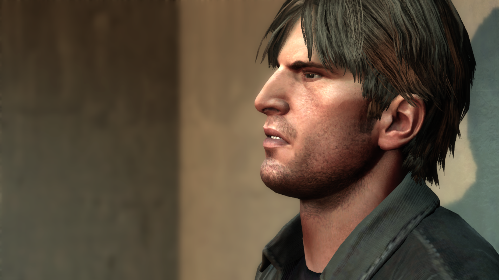
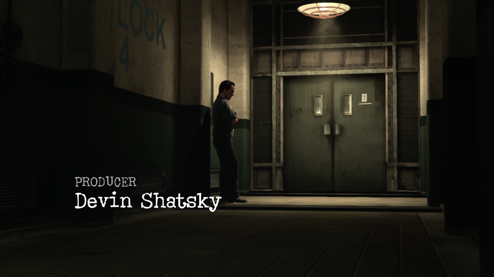
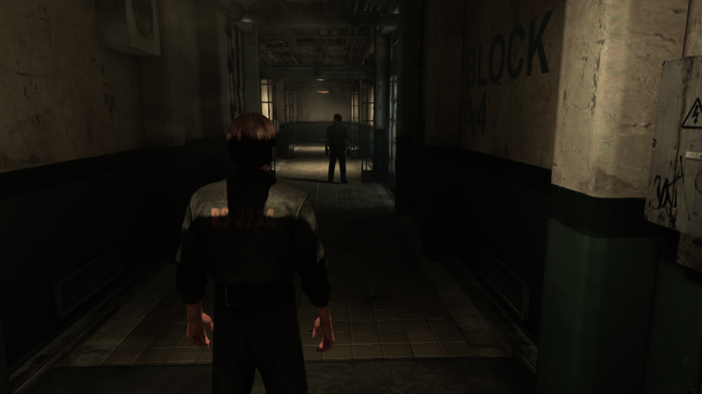

<div align="center">

# DownpourRecomp

**Silent Hill: Downpour** (Xbox 360, 2012) — natively recompiled for Windows.

[](https://github.com/LittleBitUA/DownpourRecomp/releases/latest)
[](https://github.com/LittleBitUA/DownpourRecomp/releases)
[](LICENSE)
[](https://github.com/LittleBitUA/DownpourRecomp/releases/latest)
[](https://github.com/LittleBitUA/DownpourRecomp/stargazers)



### [⬇  Download the latest release](https://github.com/LittleBitUA/DownpourRecomp/releases/latest)

</div>

---

## What is this

DownpourRecomp is a **static recompilation** of *Silent Hill: Downpour*'s Xbox 360 executable to native Windows. The PowerPC code in the original `default.xex` is translated to C++ at build time, then linked against a host runtime that emulates the Xbox 360 ABI (CPU registers, kernel objects, threading, GPU command processor + EDRAM). The result is a regular Windows process — **no emulator, no JIT, no per-frame instruction dispatch overhead**.

CPU-side game logic runs natively. The renderer is the upstream Xenia D3D12 stack, ported into ReXGlue, plus a narrow fix for the chromatic-noise artifact that surfaces on the fast RTV render-target-cache path on UE3 G-buffer titles.

Built on the [ReXGlue SDK](https://github.com/rexglue/rexglue-sdk).

> [!IMPORTANT]
> This repository contains **no Konami or Vatra Games assets**. You must own a legal copy of *Silent Hill: Downpour* (Xbox 360 USA/EUR, title id `4B4E0823`, base XEX hash `7A3D5809776EE6AB`) and provide your own dumped game data tree.

---

## Status

End-to-end playable as of **2026-06-19**.

| Subsystem | State |
| --- | --- |
| CPU recompilation | **Stable** |
| Kernel imports | Workarounds in place; no known blockers |
| GPU — D3D12 RTV/DSV path | **Working** — fast, default; chromatic-noise [fix](#the-fix) shipped |
| GPU — D3D12 ROV path | Working — slower correctness fallback |
| Audio (XAudio2) | Working |
| Input — keyboard + mouse | Working — smoothed mouse-to-stick mapping |
| Input — gamepad | Working |
| Save / load | Working |
| Achievements / online | Stubbed (single-player only) |

<div align="center">




</div>

---

## Quick start

1. **Download** the latest release zip: [v0.1.1 →](https://github.com/LittleBitUA/DownpourRecomp/releases/latest)
2. **Extract** it somewhere with read/write access.
3. **Drop your legally-owned game files** into an `assets/` folder next to `downpour.exe`. The expected layout:

   ```
   downpour.exe
   rexruntimerd.dll
   downpour.toml         ← rename from downpour.toml.sample
   assets/
     default.xex
     nxeart
     SHGame/
     AvatarAssetPack/
   ```

4. **Rename** `downpour.toml.sample` → `downpour.toml`. It already enables mouse mode and the chromatic-noise fix.
5. **Launch** via `start.bat`, or:

   ```powershell
   downpour.exe --game_data_root assets
   ```

Press `F4` in-game for the settings overlay (cvars, key binds, sensitivity, draw scale).
Press `` ` `` (backtick) for the console.

---

## The fix

> Silent Hill: Downpour exhibits a UE3 G-buffer EDRAM-aliasing pattern that triggers a depth → 7e3 (`k_2_10_10_10_FLOAT`) ownership transfer in the rexglue HostRenderTargets path. The transfer pixel shader treats the depth bits as packed 7e3 floats and decodes them via `Float7e3To32`, producing values like `(8.1875, 0.25, 0.8125, 0.333)` from clean `(0.013, 0.012, 0.008, 0.333)` HDR scene content. Those exploded HDR values propagate through the resolve → shared-memory → texture_load → gamma → composite chain, visible at the swapchain as high-frequency red/green chromatic speckle on Murphy and other surfaces.

The bug was localized via RenderDoc Pixel History on a noisy pixel in the lift scene — corruption point is **EID 9506** in a representative capture. A graphics-pipeline ownership transfer pixel shader (Pipeline State 1949) reads `xe_transfer_depth` + `xe_transfer_stencil` SRVs from a `kD24FS8 4xMSAA` source RT and writes to the `k_2_10_10_10_FLOAT 1xMSAA` HDR scene RT. Clean Xenia Canary avoids this entirely by keeping persistent host RTs and switching SRV views rather than running a format-converting transfer.

The fix is a narrow cvar in the ReXGlue SDK common render target cache — `skip_depth_color_7e3_aliasing_transfers` — that drops the queued ownership transfer **only in the depth → 7e3 direction**. The reverse direction (7e3 → depth) is preserved because Downpour menu font rendering uses it legitimately; skipping that direction breaks the brightness slider screen (blue bands + ghost text).

The cvar is opt-in (default `false` in the SDK). The shipped `downpour.toml.sample` enables it.

---

## Runtime configuration

The recompiled binary reads `downpour.toml` from its working directory. A minimal config:

```toml
# RTV chromatic-noise fix (see The fix section above).
skip_depth_color_7e3_aliasing_transfers = true

# D3D12 path: "rtv" for the fast HostRenderTargets path; "rov" for the slow but
# always-correct PixelShaderInterlock path (correctness fallback).
render_target_path_d3d12 = "rtv"

# Window / display - native 1080p by default.
window_width = 1920
window_height = 1080
fullscreen = true
video_mode_width = 1920
video_mode_height = 1080

# Soft present-rate cap.
d3d12_present_frame_limiter = true

# Mouse + keyboard. Hot-reloadable via F4.
mnk_mode = true
# mnk_sensitivity = 1.0   # default; raise/lower to taste

# Path to the game file tree (relative to this file's folder).
game_data_root = "./assets"

[log.levels]
gpu = "info"
```

All cvars are also editable live via the **F4 settings overlay**.

> [!TIP]
> For internal supersampling (sharper but heavier), open F4 → GPU and raise `draw_resolution_scale_x` / `draw_resolution_scale_y` to 2 — equivalent to DSR / VSR at 1440p downscaled to 1080p.

---

## Building from source

<details>
<summary><b>Click to expand — full build instructions</b></summary>

### Requirements

- **Windows 10/11 x86-64** with up-to-date GPU drivers (D3D12 + DXIL/DXBC).
- A discrete GPU. RTX 30-series or equivalent (≥ 6 GB VRAM) for stable 1080p; RTX 40-/50-series for headroom on 1440p / 2160p downscale or higher draw scale.
- **Visual Studio 2022** (17.8+) with the "Desktop development with C++" workload, Windows 10 SDK, and CMake/Ninja components. Or any equivalent toolchain that can build modern C++23.
- **CMake** ≥ 3.25 and **Ninja** ≥ 1.11.
- **LLVM/Clang-cl** is used by ReXGlue for the recompiled translation units; install LLVM and put `clang.exe` / `clang-cl.exe` on `PATH`.
- The ReXGlue SDK installed somewhere on disk (see below).
- A legal copy of Silent Hill: Downpour — region USA/EUR (`title id 4B4E0823`). The hash that this project's codegen was generated against is `7A3D5809776EE6AB`.

### 1. Set up the ReXGlue SDK

DownpourRecomp consumes the ReXGlue SDK as an installed CMake package. Build and install the SDK first (one-time, takes ~10 minutes):

```bash
git clone https://github.com/rexglue/rexglue-sdk.git
cd rexglue-sdk
cmake --preset win-amd64-relwithdebinfo
cmake --build out/build/win-amd64 --config RelWithDebInfo --target install
```

Note the install prefix (defaults to `out/install/win-amd64/` inside the SDK tree).

### 2. Provide the game executable

Place your own legally-extracted XEX next to the codegen output:

```
DownpourRecomp/
  assets/
    default.xex      ← your XEX, NOT included in this repository
```

`.gitignore` blocks accidental commits of any `*.xex`, `*.iso`, `*.god`, `*.dlc`, etc. Do not bypass it.

### 3. Run codegen

```bash
rexglue codegen --manifest downpour_manifest.toml
```

This translates the PPC code in `assets/default.xex` into C++ source files under `generated/default/`. The output is large (~280 MB) and is excluded from git.

### 4. Configure and build

```bash
cmake --preset win-amd64-relwithdebinfo \
      -DREXGLUE_DIR="<path-to-rexglue-install>/lib/cmake/rexglue"
cmake --build out/build/win-amd64 --config RelWithDebInfo --target downpour
```

The build outputs `downpour.exe` and depends on `rexruntimerd.dll` (copy the DLL from the ReXGlue install next to the executable).

### 5. Provide game data

The runtime needs the full game file tree (XEX is not enough — the game streams content, audio, and scripts from disk):

```
<some-folder>/
  SHGame/...            ← game content
  AvatarAssetPack/      ← Konami avatar files
  default.xex           ← the same XEX as in assets/
  nxeart                ← title metadata
```

Point the runtime at this folder using `game_data_root` in `downpour.toml` or via the `--game_data_root` command-line argument.

</details>

---

## Project structure

This is one of a small family of ReXGlue-based static-recompilation ports. The repository contains:

- The Silent Hill: Downpour codegen output (function tables, vtable address fix-ups, indirect-call targets discovered at runtime — checked into `downpour_config.toml`).
- A thin `DownpourApp` shell that overrides ReXApp hooks for any Downpour-specific behaviour.
- A `xenia_patches.toml` file with optional game patches (Unlock FPS, force 16x AF, disable FXAA, show FPS counter — disabled by default; see *Known limitations* below).

---

## Known limitations

- **Online features** (multiplayer hooks, leaderboards) are stubbed.
- **Achievements** do not unlock anywhere (no XBL backend).
- **Avatars** in the Xbox 360 dashboard sense are not rendered.
- Patches in `xenia_patches.toml` (FPS unlock etc.) are **reference-only** in this port. Recomp statically translates the relevant code paths, so runtime byte patches against guest addresses do not take effect — patching at codegen time is the proper fix path.

---

## Acknowledgements

- The [Xenia](https://github.com/xenia-canary/xenia-canary) team — the entire D3D12 GPU backend that ReXGlue derives from is their work.
- The [ReXGlue SDK](https://github.com/rexglue/rexglue-sdk) maintainers for the static recomp tooling.
- The static-recomp recipe pioneered by N64Recomp / N64: Recompiled and followed by Sonic Mania: Recompiled, Skate 3 Recomp, [Deadly Premonition Recomp](https://github.com/LittleBitUA/DPRecomp).

---

## Legal

This repository contains **no Konami or Vatra Games assets**. It is original code (build configuration, codegen metadata, application shell) that targets an existing legally-owned copy of *Silent Hill: Downpour* for personal use under the user's own jurisdiction's fair-use / private-copy provisions.

Do not distribute the game executable, game data, or any binary built against game data. Pull requests that include game content will be rejected.

Code under this repository is released under the **BSD 3-Clause license** — see [LICENSE](LICENSE).
