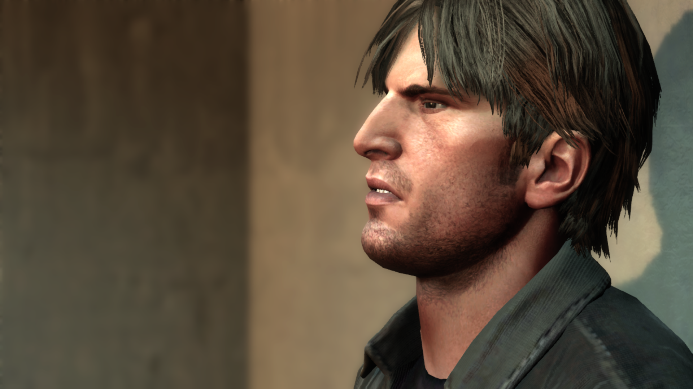
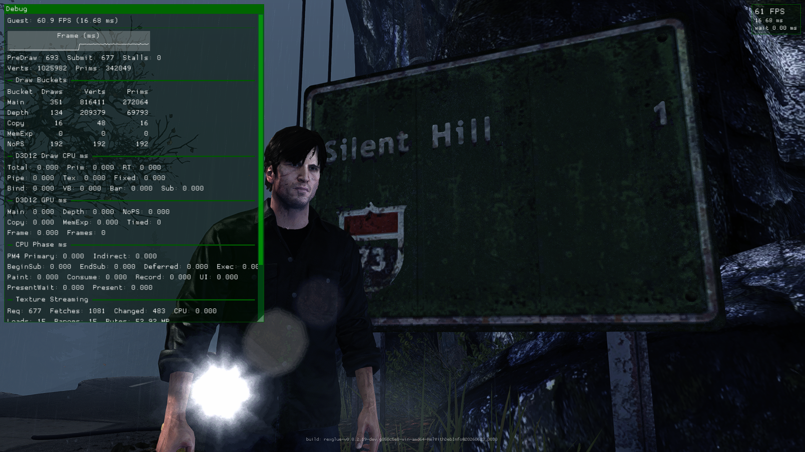
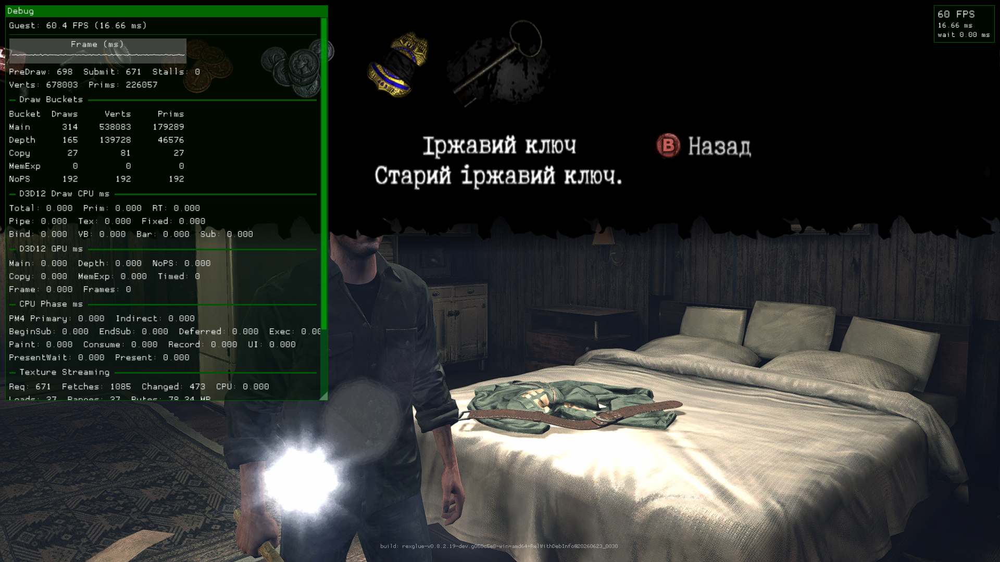

<div align="center">

# Silent Hill: Downpour — PC Port (DownpourRecomp)

### Play *Silent Hill: Downpour* natively on Windows, in 1080p at 60 FPS, with keyboard + mouse — no emulator required.

[](https://github.com/LittleBitUA/DownpourRecomp/releases/latest)
[](https://github.com/LittleBitUA/DownpourRecomp/releases)
[](LICENSE)
[](https://github.com/LittleBitUA/DownpourRecomp/releases/latest)
[](https://github.com/LittleBitUA/DownpourRecomp/stargazers)



## [⬇  Download v1.1.8 for Windows](https://github.com/LittleBitUA/DownpourRecomp/releases/latest)

</div>

---

> [!IMPORTANT]
> **v1.1.8 (hotfix, 2026-09-03)** — v1.1.7 refused to start on **Windows 10 / older Windows 11** with `Failed to get an adapter supporting Direct3D 12` ([issue #29](https://github.com/LittleBitUA/DownpourRecomp/issues/29)): the executable demanded a DirectX Agility runtime that was not in the package. v1.1.8 is v1.1.7 with that dependency removed — it uses the system Direct3D 12 runtime again, exactly like v1.1.6. Nothing else changed; if v1.1.7 already runs for you, updating changes nothing visible.

> [!NOTE]
> **v1.1.7 is out** — and it is deliberately **not** a "final" anything. It's a compilation of every update that has been accumulating on the dev machine since v1.1.6, shipped as one package **before something bigger** that is already in the works.
>
> Highlights: a **first-run disc-image installer** (community contribution by [Alexbeav](https://github.com/Alexbeav) — point it at your own ISO and it extracts everything itself), **no more AVX2 requirement** (pre-2013 CPUs boot the game now), **mouse look rebuilt on raw input** with direct displacement mapping, **nine correctness fixes ported from upstream ReXGlue v0.10**, **audio mix fixes** (bass is back in stereo mixes; one-shot SFX no longer crunch), and **achievements with unlock toasts** — press **F7** in-game to see your list. [Full notes below.](#whats-new-in-v117)
>
> Already on v1.1.x? Launch `PlayDownpour.exe` and click the pill banner — v1.1.7 installs in place; your saves, settings, and warm shader cache are preserved (and backed up to `%TEMP%` first, automatically).
>
> Older release notes live in [docs/CHANGELOG.md](docs/CHANGELOG.md).

> [!TIP]
> ## 🐭 Mouse tuning guide (v1.1.7 semantics)
>
> v1.1.7 rebuilt mouse look from scratch on **raw input with direct displacement mapping**. With "Use Raw Input" ON (the default), the pipeline is now just:
>
> ```
> deflection = deadzone_floor + |raw HID delta| × Raw Input Scale × Stick Scale
> ```
>
> Motion this frame = camera turn this frame. Hand stops = camera stops, instantly. No smoothing filter, no decay tail, no ramp — those knobs now apply **only** to the WM_MOUSEMOVE fallback path (Use Raw Input off, Wine/VM/RDP setups).
>
> | Field | Raw path (default) | Fallback path |
> |---|---|---|
> | **Use Raw Input** | ON — unaccelerated HID counts via `WM_INPUT` | OFF — Windows pointer ballistics |
> | **Raw Input Scale** | ✅ main speed knob (default `0.6`) | — |
> | **Stick Scale** | ✅ second speed knob (default `800`) | — |
> | **Deadzone Compensation** | ✅ floor for the first count of motion (default `4000`, hard-floored at the game's own stick deadzone) | ✅ ramp target |
> | **Invert Mouse Y** | ✅ | ✅ |
> | **Mouse Sensitivity / Smoothing / Acceleration Curve / Stick Decay** | — ignored | ✅ full legacy pipeline |
>
> Tuning: too slow/fast overall → **Raw Input Scale** (`0.3` deliberate ↔ `1.5` twitchy at 1600 DPI; halve for 3200 DPI, double for 800 DPI). Small motions feel dead → raise **Deadzone Compensation** toward `9000`. Flicks saturate too easily → lower **Stick Scale**.
>
> **The honest ceiling:** the game reads a controller stick, and a fully-deflected stick is the fastest turn its input model allows. Mouse now reaches that ceiling instantly, but can't exceed it — raising it needs a camera-speed patch in the game code (on the roadmap).

---

## What's new in v1.1.7

> **This is not a "final" release.** v1.1.7 is a compilation of everything that has been accumulating on the dev machine since v1.1.6 — shipped as one package before something bigger that is already in progress.

### 💿 First-run disc-image installer (community contribution)

A fresh install no longer requires you to pre-extract your game dump by hand. If the game data is missing on first launch, a new wizard asks for **your own Silent Hill: Downpour ISO** (Redump, XGD3, or raw dump layouts are auto-detected), extracts the game partition itself, then chains into the existing Title Update installer — which can also fetch TU1 automatically. Extraction is **resumable**: interrupt it, relaunch, and it continues where it stopped. Headless installs are covered by `DOWNPOUR_INSTALL_ISO` / `DOWNPOUR_INSTALL_TU` environment variables.

Contributed by **[Alexbeav](https://github.com/Alexbeav)** (PR #27) — the first external code contribution to the project. Thank you!

### 🧠 No more AVX2 requirement (issue #11)

The runtime was shipping with `-march=x86-64-v3`, which hard-requires AVX2 — CPUs older than Intel Haswell (2013) / AMD Excavator (2015) died with `0xc0000142` before the first log line. The build now targets baseline x86-64 + SSSE3 with proper Snappy feature-detection overrides. FX-8300-class machines boot the game.

### 🖱️ Mouse look rebuilt on raw input — direct displacement mapping

The raw-input mouse path was reimplemented from scratch in the runtime (`WM_INPUT`, no Windows pointer ballistics), and — after live testing — the whole stick-emulation filter chain was taken **out** of the raw path: no EMA smoothing (lag), no decay tail (camera drift after the hand stops), no ramp remap (which silently discarded small motions below the game's stick deadzone — the "mouse feels dead and slow" reports were this). Motion now maps directly: any movement instantly clears the deadzone floor; stopping stops the camera the same frame. Cursor capture also moved off the guest input-poll thread onto the UI thread, removing a poll-stall source. The legacy `WM_MOUSEMOVE` pipeline remains as the fallback (Use Raw Input off / Wine / VMs). See the [mouse tuning guide](#-mouse-tuning-guide-v117-semantics).

### 🔧 Nine correctness fixes ported from upstream ReXGlue v0.10

Hand-ported (the fork can't rebase — upstream rewrote history) and verified against this game:

* **Occlusion-query end detection** — a missed end left the game spinning in its render-thread wait loop.
* **GPU page-state coherency** — double-buffered valid-page flags could drift and serve stale state (the same bug class made character bodies invisible in another title upstream); replaced with one coherent set. Also trims spurious re-uploads.
* **APC delivery through a trap frame** + **cr2-cr4 / FPSCR in the fiber save area** — kernel callbacks and fiber switches no longer clobber guest registers or the FP rounding mode. Silent-corruption-class fixes.
* **Audio-stretch fix** — stop suppressing SDL's timer-resolution management (also helps frame pacing).
* **7e3 float decode** — HDR clear colors decoded with the mantissa in the wrong bit position.
* **Thread-context init** — a `memset` was wiping `PPCContext` defaults (including the initial `msr`).
* **Faster file opens** — exact-name stat before directory scan (streaming hitches).
* **Crash diagnostics** — unhandled guest access violations now log the guest address and thread; arena bases logged at boot so crash dumps can be decoded.

### 🔊 Audio mix fixes

* **5.1 → stereo fold rewritten**: the old fold **discarded the LFE channel entirely** (all bass — impacts, thunder — was missing from stereo/headphone mixes), used ad-hoc weights, never clamped, and the scalar path had the rear channels swapped. The new fold follows ITU-R BS.775 weights with a master-gain stage and proper clamping.
* **One-shot SFX crunch root-caused**: the decoder reset between sounds called `avcodec_flush_buffers`, which is a **no-op** for the XMA codec — the previous sound's MDCT spectral tail leaked into the next sound's first frame. The reset now forces a codec reopen, which actually discards the history.
* Clean audio-worker shutdown (drain with a timeout before the last-resort terminate).

### 🏆 Achievements — press F7

Achievement support with **unlock toasts** ships in the runtime (thanks to the upstream SDK community). Press **F7** in-game to open the achievement list and your unlock progress. Unlocks are tracked locally and persist across sessions — there is no Xbox Live, nothing leaves your machine.

### 🧹 Housekeeping

* The in-game log no longer floods: per-frame diagnostic lines are gated behind opt-in cvars, and the VFS "entry not found" lines (the game legitimately probing save-backup names) dropped to debug level.
* The F4 settings overlay no longer lists dead experimental cvars — the retired native-render experiment left the build entirely (−22,000 lines).
* The non-functional DoF-scale scaffolding was removed rather than shipped broken.

### What this does NOT include (yet)

* **DoF disable** — still open; the previous patch approach was confirmed to write FName metadata instead of the actual blur values.
* **In-game audio volume sliders** — still queued (Coalesced SoundGroups rewrite).
* **XMA loop-wrap fix** (looped ambience silences its last 192 samples per loop) — the fix exists upstream but replaces the decoder's output stage; ours is heavily customized, so it needs a dedicated session with listening tests.
* **The bigger thing** this release clears the deck for.

Older releases: [docs/CHANGELOG.md](docs/CHANGELOG.md).

---

## Preview

<div align="center">

| Murphy at the *Silent Hill* sign | Yard / twilight |
| --- | --- |
|  |  |

| Bedroom — Ukrainian localization in-game | Rusty key pickup — Ukrainian item description |
| --- | --- |
|  |  |

</div>

---

## What is this?

**DownpourRecomp is a native Windows port of *Silent Hill: Downpour* (Konami / Vatra Games, Xbox 360, 2012).** The original Xbox 360 game is converted into a regular Windows program — once and for all, at build time — so it runs on your PC the same way as any other Windows app.

If you've used Xenia or RPCS3 before, this is **not** that. There is no emulator, no JIT translator, no per-frame interpretation overhead. The PowerPC code in the original binary is translated into native x86-64 C++ ahead of time, then linked against a small host runtime that handles the Xbox-specific parts (input, kernel calls, GPU command processor, EDRAM). The result is a real `downpour.exe` that boots like any other game.

This technique is called **static recompilation** — the same idea behind [N64: Recompiled](https://github.com/Mr-Wiseguy/N64Recomp), Skate 3 Recomp, and [DPRecomp](https://github.com/LittleBitUA/DPRecomp) (the same author's *Deadly Premonition* port). DownpourRecomp uses the [ReXGlue SDK](https://github.com/rexglue/rexglue-sdk) — a Xenia-derived Xbox 360 host runtime — as the foundation.

*Silent Hill: Downpour* never received an official PC release; this project exists to be that release: a native Windows process, full mouse + keyboard support, 60 FPS, and the entire CPU side running at native x86-64 speed.

> [!NOTE]
> **You provide your own legally-owned copy of the game.** The release zip is the host shell only. It does not contain `default.xex`, game data, music, or any Konami / Vatra assets. See [What you need before playing](#what-you-need-before-playing).

<details>
<summary><b>How this was built — transparency note (AI assistance)</b></summary>

This project uses AI assistance (Claude Code) alongside hands-on reverse-engineering and engineering work. Where the line falls:

**Hands-on work that drove every key decision:** Ghidra reverse-engineering of the base XEX and TU1 PE; RenderDoc captures and pixel-history bisection (chromatic-noise fix, DXT5 alpha forensic); ~55 instrumented playtest sessions with frame-time logs analysed by hand; A/B testing every render-path decision; manual identification of community recipes. The test bench is real and named honestly: Intel Core i5-13400F + RTX 5070 + Win 11.

**Where AI assistance was used:** C++ implementation of SDK additions once the design was decided; HLSL shader writing; CMake/build automation; documentation drafts. Every word reviewed by a human before merging; technical claims grounded in real measurements or captures.

**Never delegated:** what renders incorrectly and what the user actually sees; what ships and what doesn't (broken experiments get reverted byte-perfect, not left in); architecture trade-offs.

If something feels off about a claim in these docs, open an issue — we'll back it up with the underlying capture / log / measurement, or correct the docs.

</details>

<details>
<summary><b>Comparison vs Xenia and the Xbox 360</b></summary>

| | Xbox 360 (original) | Xenia emulator | **DownpourRecomp** |
| --- | --- | --- | --- |
| **Resolution** | 720p (HDMI) | up to 4K (DSR) | up to 4K, native 1080p default + 2× SSAA |
| **Frame rate** | 30 FPS | 30 FPS (UE3 cap) | **60 FPS unlocked** (recompile-time patch) |
| **Input** | Xbox 360 controller only | XInput controllers | XInput + **native mouse & keyboard** |
| **First-run setup** | disc | dumped XEX + game data | **your own ISO → built-in installer wizard** |
| **Settings UI** | in-game options menu | Xenia F11 / config files | **standalone launcher + in-game F4 overlay** |
| **CPU execution** | PowerPC native | Dynamic recompiler (JIT) | **Statically recompiled to native x86-64** |
| **CPU requirement** | n/a | AVX-capable | **any x86-64 CPU with SSSE3** (v1.1.7+) |
| **Shader cache** | n/a | rebuilds per-driver-update | **ships pre-warmed** (~1,370 PSOs) |
| **Achievements** | Xbox Live | no | **local unlocks + toasts, F7 list** (v1.1.7+) |
| **Colour grade** | as authored | none | **7 ASC-CDL presets** |
| **Portable layout** | n/a | %AppData% / OS paths | **saves + cache stay in the game folder** |
| **Modding hooks** | none | limited | C++ source-level hooks |

</details>

---

## What you need before playing

The download is **the application only**. You bring the game:

1. **A legally-owned copy of *Silent Hill: Downpour* for Xbox 360** — disc, digital download, or backup of either. Region USA or EUR (`title id 4B4E0823`, base XEX hash `7A3D5809776EE6AB`).
2. **A dump of that copy** — since v1.1.7 a plain **ISO of your disc is enough**: the first-run wizard extracts everything itself (Redump / XGD3 / raw layouts auto-detected) and stages Title Update 1 for you. Pre-extracted file trees from older versions keep working as before.
3. A Windows 10/11 x86-64 PC with a D3D12-capable GPU (RTX 30-series or equivalent recommended for 1080p 60).

> [!IMPORTANT]
> Do not ask in the issue tracker or anywhere else where to get the game. Bring your own legally-acquired copy.

## How to install and play

1. **Download** the latest release zip: [DownpourRecomp →](https://github.com/LittleBitUA/DownpourRecomp/releases/latest)
2. **Extract** it somewhere with read/write access (e.g. `C:\Games\DownpourRecomp\`).
3. **Double-click `PlayDownpour.exe`** and hit Play.
4. **First run:** the installer wizard asks for your game dump — point it at your ISO (or an already-extracted `assets/` tree) and, when prompted, at your `default.xexp` Title Update file (or let it download TU1). Extraction is resumable if interrupted.
5. Play. First boot compiles the GPU-vendor shader library (~13 s on an RTX 5070); every subsequent boot is instant.

In-game: **F4** — settings overlay (hot-reloadable cvars), **F7** — achievements, **F3** — diagnostics. The launcher's tabs (Graphics / Mouse / Controls / UE3 Engine / Debug) cover the same settings with sliders, and write them to `downpour.toml` next to the executable.

The layout is **portable**: saves, config, and the warm shader cache all live in the game folder. Move the folder — everything moves with it.

<details>
<summary><b>Default controls (mouse + keyboard)</b></summary>

| Action | Default key | Notes |
| --- | --- | --- |
| Move | `W` `A` `S` `D` | Left-stick emulation |
| Camera | Mouse | Raw-input mouse look (v1.1.7 semantics) |
| Attack | `LMB` | Gamepad X |
| Block | `RMB` | Gamepad Y |
| Throw / shoot (RT) | `LMB` | Right-trigger chord |
| Lock-on / aim (LT) | `RMB` | Left-trigger chord |
| Run / sprint | `Shift` | Right-shoulder |
| Look back | `Z` | Left-shoulder |
| Interact / select | `E` | Gamepad A |
| Cancel / drop item | `G` | Gamepad B |
| Flashlight | `F` | Left-stick press |
| Zoom camera | `MMB` | Right-stick press |
| Inventory / heal | `↑` (or `1`) | D-Pad up |
| D-Pad down / left / right | `↓` `←` `→` (or `2` `3` `4`) | |
| Open journal | `Tab` | Gamepad Back |
| Pause menu | `Esc` | Gamepad Start |

**DualSense (PS5):** full support over USB and Bluetooth, Level-1 adaptive triggers on by default (Weapon-mode RT with a click-point break, Feedback-mode LT). All 9 trigger parameters exposed in the launcher's Controls tab. **Xbox controllers** work out of the box.

**Rebinding:** launcher → Controls tab — every action is a text field (`W`, `LMB`, `Up`, `Shift`, …). Saved straight into `downpour.toml`.

</details>

<details>
<summary><b>Runtime configuration reference (downpour.toml excerpt)</b></summary>

For most users the launcher's tabs cover everything. Power-users who edit `downpour.toml` directly — the key shipped defaults:

```toml
# ===== Render path & quality =====
render_target_path_d3d12 = 'rov'      # auto-pinned to 'rtv' on AMD by the launcher
resolution_scale = 2                  # 2x SSAA (auto-seeded to 1 on <8GB VRAM)
anisotropic_override = 5              # 16x AF
swap_post_effect = 'fxaa'
skip_depth_color_7e3_aliasing_transfers = true   # chromatic-noise fix

# ===== Present =====
present_effect = 'fsr3'
d3d12_present_frame_limiter = true
d3d12_present_frame_limiter_fps = 60.0

# ===== 60 FPS lock =====
video_mode_refresh_rate = 120.0       # guest expects half-vblank ticks
vsync = true

# ===== Shader-compile stutter control =====
pso_missing_policy = 'skip'
d3d12_pso_no_block_at_submission_end = true
d3d12_pso_library_enable = true

# ===== Input =====
mnk_mode = true
mnk_capture_mouse = true
mnk_use_raw_input = true              # v1.1.7 raw-input mouse look
mnk_raw_input_scale = 0.6
mnk_stick_scale = 800.0
mnk_deadzone_compensation = 4000
mnk_invert_y = false

# ===== Correctness pins (do NOT flip) =====
readback_memexport = true             # required for HUD text
gpu_allow_invalid_fetch_constants = false
```

The launcher round-trips this file non-destructively — keys it doesn't recognise are preserved.

</details>

---

## Frequently asked questions

<details>
<summary><b>Is this an emulator?</b></summary>

No. An emulator runs the original Xbox 360 instructions on a virtual CPU at runtime. DownpourRecomp converts the Xbox 360 instructions into native x86-64 code at build time, so what you run is a real Windows executable. The game is "re-translated" once, not interpreted on every frame.

</details>

<details>
<summary><b>Why isn't the game executable included? Where do I get it?</b></summary>

Including the game's binary or any of its data would be copyright infringement. Bring the ISO / XEX from your own legally-owned copy of the Xbox 360 release. We will not tell you where to download one, and asking will get your issue closed.

</details>

<details>
<summary><b>Can I unlock the frame rate above 30 FPS?</b></summary>

60 FPS is the default since v1.0 — the frame-skip patch is applied to the recompiled C++ source at build time, with `video_mode_refresh_rate = 120` + `vsync = true` so the game logic runs the full guest tick. Beyond 60 FPS is not planned: UE3's tick code was tuned for 30/60, and uncapped framerates break animation, physics, and camera per-system.

</details>

<details>
<summary><b>Does mouse and keyboard work?</b></summary>

Yes — this is the first time the game can be played with a mouse and keyboard, and since v1.1.7 mouse look runs on raw input with direct displacement mapping (no smoothing lag, no drift). Every controller button is rebindable to keyboard/mouse via the launcher's Controls tab or F4 in-game. See the [mouse tuning guide](#-mouse-tuning-guide-v117-semantics).

</details>

<details>
<summary><b>Do achievements unlock?</b></summary>

**Yes, since v1.1.7** — locally. Unlocks pop a toast in-game, persist across sessions, and the full list with your progress is on **F7**. There is no Xbox Live backend, so nothing syncs to Microsoft servers — and nothing needs to.

</details>

<details>
<summary><b>What about ultrawide, HDR, ray tracing?</b></summary>

2012 UE3 title — no native HDR or RT. Ultrawide is not aspect-corrected yet (you'd get a stretched 16:9 image); a proper UE3 FOV patch is on the long-term list.

</details>

<details>
<summary><b>I get error <code>0xc0000142</code> when launching.</b></summary>

`STATUS_DLL_INIT_FAILED`. Most common cause: missing **Microsoft Visual C++ Redistributable (x64)** — install from <https://aka.ms/vs/17/release/vc_redist.x64.exe> and reboot. (Note: the *other* historic cause — a pre-2013 CPU without AVX2 — is fixed in v1.1.7; the runtime now needs only SSSE3.)

Still failing? Check Windows Defender quarantine (restore `rexruntimerd.dll` and add an exclusion), re-extract to a path with no non-ASCII characters, verify file sizes match the release page, and confirm Windows 10 1909+ / Windows 11.

</details>

<details>
<summary><b>I'm getting a crash / artefact / weird behaviour. What do I do?</b></summary>

Open a [GitHub Issue](https://github.com/LittleBitUA/DownpourRecomp/issues) with: the exact symptom and scene, a screenshot/video if visual, the `logs/` folder, your `downpour.toml`, and your GPU model + driver version. Do **not** attach any game files.

</details>

---

<details>
<summary><b>Building from source</b></summary>

### Requirements

Windows 10/11 x86-64, Visual Studio 2022 (17.8+) with C++ workload, CMake ≥ 3.25, Ninja ≥ 1.11, LLVM/Clang on `PATH`, and a legal copy of the game (`title id 4B4E0823`, hash `7A3D5809776EE6AB`).

For the experimental Apple Silicon build, see [macOS port status and build notes](docs/MACOS_PORT.md). It has no release artifact or gameplay validation yet.

### Steps

```bash
# 1. Build the SDK (Downpour fork)
git clone https://github.com/LittleBitUA/rexglue-sdk-dpour.git
# 2. Provide your XEX at assets/default.xex (gitignored)
# 3. Generate the recompiled sources
rexglue codegen --manifest downpour_manifest.toml
# 4. Configure + build
cmake -G Ninja -B out/build/win-amd64 -DCMAKE_BUILD_TYPE=RelWithDebInfo \
      -DCMAKE_C_COMPILER=clang -DCMAKE_CXX_COMPILER=clang++ \
      -DREXSDK_DIR=<path-to-rexglue-sdk-dpour>
ninja -C out/build/win-amd64 downpour
```

Produces `downpour.exe` + `rexruntimerd.dll`. Deploy them together — they are a matched pair.

</details>

## Technical deep-dives

- 📦 [v1.0 release overview](docs/v1.0-release-overview.md) — test methodology, frame-time distribution, what ships in the zip.
- 🚀 [v1.0 performance journey](docs/v1.0-performance.md) — every perf-relevant change from v0.1.1 to v1.0.
- 📜 [Chromatic-noise fix](docs/chromatic-noise-fix.md) — RenderDoc pixel-history backward trace to the depth→7e3 ownership transfer.
- 🌫 [DoF disable — investigation history](docs/v1.0-dof-investigation.md) — 11 approaches tried and why each failed.
- ⚫ [DXT5 / BC3 alpha decode bug](docs/v1.0-dxt5-alpha-bug.md) · 📏 [Resolution-scale notes](docs/v1.0-resolution-scale-notes.md) · 🐛 [Known issues](docs/v1.0-known-issues.md)
- 📋 [Full release history](docs/CHANGELOG.md)

## Companion repository: the SDK

The runtime DLL next to `downpour.exe` comes from a Downpour-specific fork of the ReXGlue SDK — source is public: **[LittleBitUA/rexglue-sdk-dpour](https://github.com/LittleBitUA/rexglue-sdk-dpour)** (`dpour-main` branch). It carries the PSO stutter fixes, memexport readback batching, the v1.1.7 raw-input mouse driver, the audio-mix fixes, DualSense adaptive triggers, and the upstream v0.10 correctness ports.

---

## Acknowledgements

- The [Xenia](https://github.com/xenia-canary/xenia-canary) team — the D3D12 GPU backend that ReXGlue derives from is their work.
- The [ReXGlue SDK](https://github.com/rexglue/rexglue-sdk) maintainers for the static recomp tooling and the steady stream of upstream fixes.
- **[Alexbeav](https://github.com/Alexbeav)** for the first-run disc-image installer (PR #27) — the project's first external code contribution.
- Everyone who filed issues with logs, screenshots, and hardware details — the AVX2 fix, the VSync fix, the mouse rework, and the save-backup safety net all started as your reports.
- The static-recomp recipe pioneered by [N64: Recompiled](https://github.com/Mr-Wiseguy/N64Recomp).

## Legal

This repository contains **no Konami or Vatra Games assets, no game code, no game data, no game audio.** It is original code (build configuration, codegen metadata, application shell) that targets a separately-supplied, legally-owned copy of *Silent Hill: Downpour*.

Do not distribute the game executable, game data, or any binary that links against game data. Pull requests that include game content will be rejected.

Host-side source is released under the **BSD 3-Clause license** — see [LICENSE](LICENSE). The recompiled game code produced at build time (`generated/default/`) is derived from the copyrighted game binary and is **not** covered by this license.

---

<div align="center">

**Related projects by the same author:**
[DPRecomp — Deadly Premonition (PC port)](https://github.com/LittleBitUA/DPRecomp)

---

### 🇺🇦 MADE IN UKRAINE 🇺🇦

</div>
